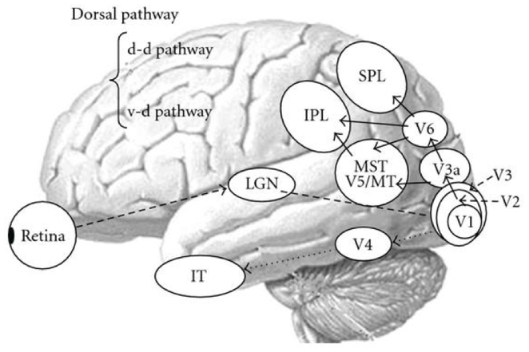
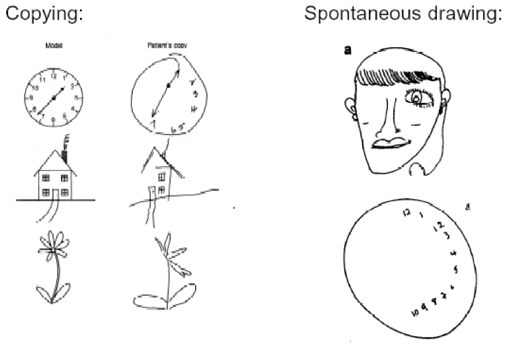

# High-Level Vision I: How Do We Perceive? (2021-09-14)

> Course: PSYCH-UH 2412 Cognitive Neuroscience | NYU Abu Dhabi | Authors: Sean Shan Guangji & Yumi Omori

---

## Sensation vs. Perception

- **Sensation**: the process by which the nervous system receives and represents physical stimulus energy.
- **Perception**: the process of organizing, interpreting, and consciously experiencing signals from our environment.
- Receiving and encoding information vs. Interpreting and experiencing that information.

---

## Sensory Systems

- (Some of) the problems a sensory system has to solve:

### Differentiate between physical stimuli.

- Different types of physical stimuli activate different types of specialized receptors.
  - Each receptor responds to one type of stimulus energy.
    - Rods & Cones in retina → Light.
    - Taste buds on tongue → Chemicals.
- Different sensations are carried to the brain via different pathways.
- Different sensations are processed by different parts of the brain.

### Localize a physical stimulus.

- How do we localize stimuli in space?
  - **Spatial receptive fields**: receptors and neurons respond to sensations in a specific area of space.
    - Touch receptors.
    - Photoreceptors.

  - Receptive fields have a center and size. (The smaller the receptive size, the higher the acuity.)

### Represent the intensity of a physical stimulus.

---

## Perception as an Inference

- **Inference**: a conclusion reached on the basis of evidence and reasoning.
- "Seeing is not a direct apprehension of reality, as we often like to pretend. quite the contrary: seeing is an inference from incomplete information." —e.t. Jaynes
- When we perceive, we combine the evidence (incomplete information) with our prior knowledge of the world.

- Example: the directionality of the visual pathway—there are more fibers carrying information against the flow of information (in the reverse direction) with respect to the classical flow of information from the primary visual cortex to other areas. This means that more information about our model of the world influences the incoming visual information than information about the visual stimulus itself influences the higher areas.

---

## Hierarchy of the Visual System

- **V1** (primary visual cortex, Brodmann area 17): retinal location, orientation, spatial frequency, color, binocular disparity.
- Higher areas encode increasingly complex features.
- Moving up the **ventral visual stream** (V1 → V2 → V4 → IT): Objects — what.
- Moving up the **dorsal visual stream** (V1 → V2 → V5/MT → PP): Actions — where/how.

---

## Receptive Fields

- **Receptive field**: the region of the visual field in which the presence of a stimulus will alter the firing rate of a neuron.
- Simple vs. complex cells (Hubel & Wiesel, 1962):

---

## Visual Perception Models

### View-Dependent Models

- Representation is based on the view of the object.
  - Tarr & Pinker (1989): mental rotation; objects recognized faster when presented at familiar orientations.

### View-Independent Models

- Representation is based on the structural description of the object.
  - Biederman (1987): Recognition by Components theory (RBC); objects are made of **geons** (geometric ions) which are viewpoint-invariant.

---

## Prosopagnosia

- **Prosopagnosia** (face blindness): inability to recognize faces.
  - Even famous faces or one's own face in a mirror.
  - Can usually identify individuals by voice, gait, or context.
- Caused by damage to the **right fusiform gyrus**.

---

## Visual Agnosia

- **Visual agnosia**: inability to recognize objects, despite intact visual acuity.
  - Intact low-level vision (acuity, color, motion detection).
  - Deficit in higher-level processing.

---

## Imagery and Perception: Same Neural Substrate?

- fMRI studies: imagining a visual scene activates V1 and higher visual areas.
- Mental imagery shares neural substrates with perception.

---

## Illusory Contours

- V2 neurons respond to illusory contours (Kanizsa triangle).

