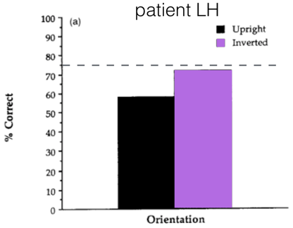

# High-Level Vision II: Modularity; fMRI (2021-09-16)

> Course: PSYCH-UH 2412 Cognitive Neuroscience | NYU Abu Dhabi | Authors: Sean Shan Guangji & Yumi Omori

---

## Why Study Face Perception?

- Ubiquitous (fundamental & universal) and highly practiced (we are experts).
- Socially important.
- Hardwired: we see faces everywhere (pareidolia)!

---

## Is Face Perception Special?

- **Special** = a dedicated neural system (possibly with dedicated encoding mechanisms) for face recognition.

### Behavioral Evidence: The Face Inversion Effect

- Faces are processed holistically — not as a set of features, but as a whole.
- Inverted faces are much harder to recognize than inverted objects.

### Behavioral Evidence: The Part-Whole Effect

- Recognition of a face part (e.g., the nose) is better when presented in the context of a whole face than in isolation.

### Behavioral Evidence: The Composite Face Effect

- Composite faces (top half of one person + bottom half of another) are very difficult to separate.
- When the two halves are misaligned, recognition is easier — the holistic processing is disrupted.

---

## Neuropsychological Evidence

### Prosopagnosia (Face Blindness)

- Can recognize objects (e.g., cars, glasses) but cannot recognize faces.
- **Double dissociation**: patients who can recognize faces but not objects (visual agnosia) also exist.

### Capgras Syndrome

- Believes that someone close (family member, friend) has been replaced by an identical impostor.
- **Disconnection** between the face recognition system and the emotional response system.

---

## The Fusiform Face Area (FFA)

- Kanwisher et al. (1997): a region in the right fusiform gyrus responds **selectively to faces** (compared to other objects).

---

## fMRI: Functional Magnetic Resonance Imaging

### How Does fMRI Work?

- **BOLD signal** (Blood Oxygen Level Dependent):
  - Neural activity → increased metabolic demand → increased blood flow to active region → change in ratio of oxygenated to deoxygenated hemoglobin → MR signal change.

### The Hemodynamic Response Function (HRF)

- Neural activity → BOLD response peaks ~5 seconds later.
- Slow compared to neural events.

### Spatial Resolution vs. Temporal Resolution

- **Spatial resolution**: ~1–3 mm (good).
- **Temporal resolution**: ~2–3 s (poor, limited by HRF).

---

## fMRI Experimental Designs

### Block Design

- Conditions are presented in blocks (e.g., 20 s of faces, 20 s of objects).
- **Advantages**: high statistical power, simple to analyze.
- **Disadvantages**: poor temporal resolution; cannot separate individual trials.

### Event-Related Design

- Individual trials are presented with varying inter-trial intervals.
- **Advantages**: can isolate individual trial responses; study order effects.
- **Disadvantages**: lower statistical power.

### Mixed Design

- Combines block and event-related designs.

---

## fMRI Analysis

### General Linear Model (GLM)

- The BOLD signal at each voxel is modeled as a linear combination of predictors (regressors).
- Regressors are created by convolving the stimulus onset function with the HRF.

### Statistical Thresholding

- Multiple comparisons problem: ~50,000–100,000 voxels tested.
- Solutions: Bonferroni correction, FDR (False Discovery Rate), cluster-extent thresholding.

---

## Modularity

- **Modularity** (Fodor, 1983): the mind consists of specialized, encapsulated modules.
  - Domain-specific: each module processes a specific type of information.
  - Informationally encapsulated: modules do not have access to each other's computations.
  - Mandatory operation: cannot choose not to process.
  - Fast, automatic.

### Evidence For Modularity

- Neuropsychological dissociations (e.g., prosopagnosia, alexia).
- Neuroimaging: selective activation of regions for specific categories (faces, places, bodies, words).

### Evidence Against Modularity (Distributed Processing)

- fMRI multi-voxel pattern analysis (MVPA): category information is distributed across cortex.
- "Expertise" effect: FFA also activated by non-face objects of expertise (e.g., cars in car experts).

---

## The Parahippocampal Place Area (PPA)

- Epstein & Kanwisher (1998): a region in the parahippocampal gyrus responds selectively to **places/scenes**.

---

## The Extrastriate Body Area (EBA)

- Downing et al. (2001): a region in the extrastriate cortex responds selectively to **bodies and body parts** (not faces).

---

## The Visual Word Form Area (VWFA)

- Cohen et al. (2000): a region in the left fusiform gyrus responds selectively to **visual words/letter strings**.
- Activated regardless of font, case, or modality (visual vs. auditory imagination of words).

---

## Top-Down Effects on Visual Processing

- **Attention** modulates activity in visual cortex (even V1).
- **Expectation/priors** can modulate perception (predictive coding framework).

---

## Object Recognition: Computational Models

### Template Matching

- Compare input to stored templates.
- Problem: too many templates needed; not viewpoint-invariant.

### Feature Detection

- Detect local features (edges, corners) and combine.
- Problem: binding problem.

### Deep Neural Networks (DNNs)

- Hierarchical feature extraction similar to the visual cortex.
- State-of-the-art performance on object recognition tasks.
- V1 ↔ early conv layers; IT ↔ later conv layers.

---

## The Binding Problem

- How does the brain combine separately processed features (color, shape, motion) into a coherent percept?
- **Feature Integration Theory** (Treisman): features are bound by **focused spatial attention**.

---

## Change Blindness and Inattentional Blindness

- **Change blindness**: failure to detect changes in a scene when visual attention is diverted.
- **Inattentional blindness**: failure to notice an unexpected object when attention is focused elsewhere (e.g., gorilla experiment).
