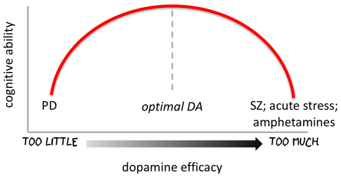
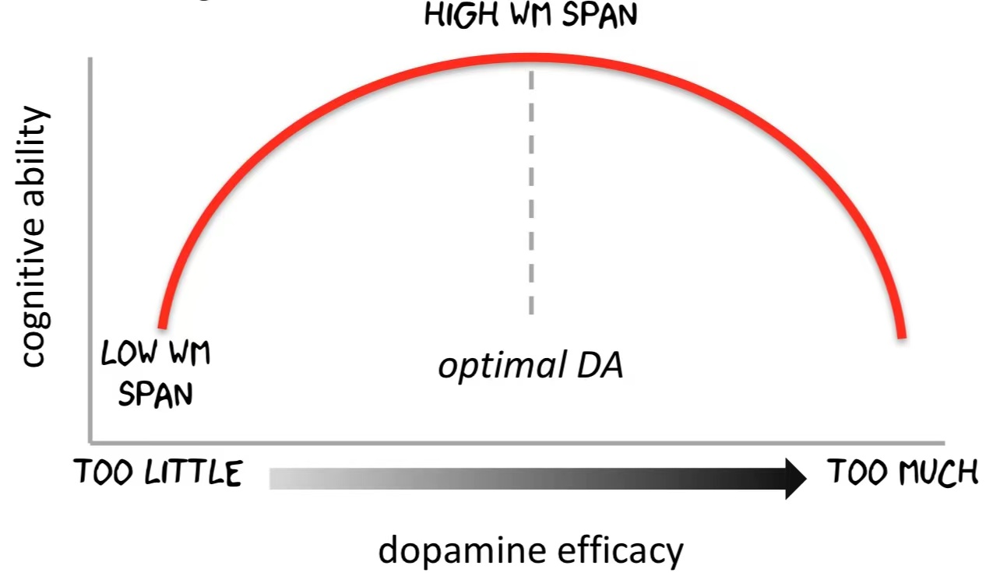
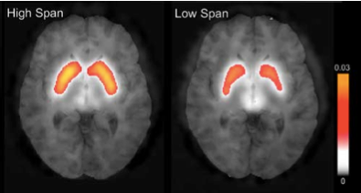

# Attention I: Cognitive Models; M/EEG (2021-10-07)

> Course: PSYCH-UH 2412 Cognitive Neuroscience | NYU Abu Dhabi | Authors: Sean Shan Guangji & Yumi Omori

---

## What is attention?

- "Everyone knows what attention is. It is the taking possession by the mind, in clear and vivid form, of one out of what seems several simultaneously possible objects or trains of thought." — William James (1890)
- More technically: selective processing of relevant information and suppression of irrelevant information.

---

## Types of Attention

### Spatial (or Selective) Attention

- Attending to a **location** in space.
- **Overt**: move your eyes (saccade) to the attended location.
- **Covert**: attend without moving eyes.

### Feature-Based Attention

- Attending to a **feature** (e.g., color, orientation) across the visual field.

### Object-Based Attention

- Attending to an **object** rather than a location or feature.

### Temporal Attention

- Attending to a **moment in time**.

---

## Cognitive Models of Attention

### Early Selection (Broadbent, 1958)

- Filtering occurs **before** full perceptual analysis.
- The bottleneck is at the sensory level.

### Late Selection (Deutsch & Deutsch, 1963)

- All stimuli are processed to the level of **meaning** before selection.
- The bottleneck is at the response/memory level.

### Attenuation Model (Treisman, 1964)

- Unattended stimuli are **attenuated** (not eliminated).
- Unattended stimuli can break through if they are personally significant (e.g., your own name).

### Capacity / Resource Models

- Kahneman (1973): attention as a **limited resource** that can be flexibly allocated.
- Multiple resource theory (Wickens): separate pools of resources for different processing modalities.

---

## Posner Cueing Paradigm

- Posner (1980): spatial cues precede targets.
  - **Valid cue**: cue correctly predicts target location.
  - **Invalid cue**: cue incorrectly predicts target location.
  - **Neutral cue**: no spatial information.
- **Result**: valid cue → faster RT; invalid cue → slower RT.
- Demonstrates **covert spatial attention**.

---

## Endogenous vs. Exogenous Attention

- **Endogenous (voluntary)**: top-down, goal-directed. Cue at fixation (e.g., arrow).
  - Slower to deploy (~300 ms), long-lasting, overrideable.
- **Exogenous (automatic)**: bottom-up, stimulus-driven. Peripheral onset.
  - Faster to deploy (~100 ms), short-lasting, not overrideable.

---

## Attention and Eye Movements

- **Pre-motor theory**: covert attention shifts precede and are linked to eye movements (saccades).
- Suppressing a saccade to a location also suppresses covert attention to that location.

---

## Visual Search

- **Feature search** (pop-out): target defined by a single feature (e.g., red among greens). RT independent of set size → **parallel search**.
- **Conjunction search**: target defined by combination of features (e.g., red vertical among red horizontals and green verticals). RT increases with set size → **serial search**.

---

## EEG and MEG

### EEG (Electroencephalography)

- Measures **electric potential** on the scalp due to synchronous firing of pyramidal neurons.
- **Advantages**: millisecond temporal resolution, low cost, portable.
- **Disadvantages**: poor spatial resolution (~1 cm); volume conduction problem.

### MEG (Magnetoencephalography)

- Measures **magnetic fields** generated by intracellular currents in neurons.
- **Advantages**: millisecond temporal resolution; better spatial resolution than EEG (not affected by skull); more sensitive to tangential sources.
- **Disadvantages**: expensive, large, magnetically shielded room required.

---

## Event-Related Potentials (ERPs)

- **ERP**: average of EEG signal time-locked to stimulus onset across many trials.
- **Averaging** cancels out noise → reveals stimulus-locked neural response.

### Key ERP Components for Attention

- **P1** (positive, ~100 ms, occipital): **enhanced** by spatial attention at the attended location.
- **N1** (negative, ~150–200 ms, occipital): enhanced by spatial attention.
- **P300** (positive, ~300 ms, parietal): occurs to rare, task-relevant targets (attention + working memory).
- **N2pc** (negative, ~200–250 ms, posterior contralateral): index of **attentional selection** of a target among distractors. Lateralized to contralateral side of attended item.

---

## Neural Oscillations and Attention

- **Alpha (8–12 Hz)**: associated with **suppression** of unattended regions.
  - Alpha power increases contralateral to the unattended location.
  - Alpha power decreases contralateral to the attended location.
- **Gamma (>30 Hz)**: associated with **active processing** in attended regions.
- **Beta (13–30 Hz)**: associated with **maintaining** the current cognitive/motor state.

---

## Spatial Attention Effects in Visual Cortex (fMRI)

- Attending to a location **enhances** BOLD response in retinotopic areas corresponding to that location.
- Effects found as early as V1.
- Attentional effects are **multiplicative** (gain modulation) rather than additive.

---

## Top-Down vs. Bottom-Up Attention

- **Top-down (endogenous)**: driven by current goals and expectations (frontal + parietal → visual cortex).
- **Bottom-Up (exogenous)**: driven by salient physical properties of stimuli (visual cortex → frontal + parietal).

---

## Fronto-Parietal Attention Network

- **Dorsal attention network (DAN)**: FEF (frontal eye fields) + IPS (intraparietal sulcus). Top-down, goal-directed attention.
- **Ventral attention network (VAN)**: TPJ (temporoparietal junction) + VFC (ventral frontal cortex). Bottom-up, stimulus-driven reorienting.

