# Attention I: Cognitive Models; M/EEG (2021-10-07)

> Course: PSYCH-UH 2412 Cognitive Neuroscience | NYU Abu Dhabi | Authors: Sean Shan Guangji & Yumi Omori

---

## What is attention?

- "Everyone knows what attention is. It is the taking possession by the mind, in clear and vivid form, of one out of what seem several possible objects or trains of thought. It implies withdrawal from some things in order to deal effectively with others". – William James, 1890
- The ability to focus our processing resources on a subset of our internal or external environment.

---

## Change blindness

- Change blindness is a phenomenon of visual perception that occurs when a stimulus undergoes a change without this being noticed by its observer.
- To date, the effect has been produced by changing images displayed on screen as well as changing people and objects in an individual's environment.
- Attention allows us to manage such an overlook. It narrows down the field for us and allows us to focus out processing of resources on some subsets of the environment.

---

## Taxonomy of attention

- What types of things are we able to pay attention to?
  - The ability to focus our processing resources on a subset of our internal or external environment.
    - Vision, sound, taste, touch, feelings, thoughts, memories…
- What drives our attention?
  - **Exogenous attention: stimulus-driven attention. (Bottom-up)**
    - Directed to salient information in our environment.

  - **Endogenous attention: goal-driven attention. (Top-down)**
    - Directed to information relevant for our goals.

  - Both forms of visual attention are independent of eye movements! (confound)
  - Neither form has something to do with early or late selection. (Will be elaborated later)

---

## Attention in Two Parts

- **Part I**: how does attention change how we process information?
  - What are the *consequences* of attention for **behavior** and sensoriperceptual processing in the brain?
- **Part II**: how do we select what we want to attend to in our environment?
  - Endogenous attention: goal-driven attention:

---

## Part I

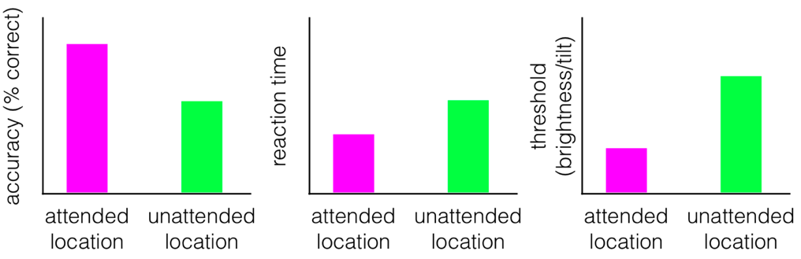

- The arrow indicates which side people should direct their attention to.
- The gaze should be fixed on the arrow. (To disassociate people's attention from the center of their gaze/vision.)
- Thought question: is "fixing the attention & changing the stimuli" or "fixing the stimuli & changing the attention" better?
  - The latter one because the sensory inputs remain the same.

---

## Consequences of Attention

- Better detection & discrimination.
  - Detection: was a dot present or not?
  - Discrimination: was a line tilted L or R?

(Or how much is a tilt)

- Even though the visual stimulation is identical between these two, the focus of attention causes some differences.
- **Important consequence:** we have worse* detection and discrimination for unattended information!
  - Push/pull mechanism. (Just like what William James said)
- Thought question: Can we really say this (attention is worse) from the data given? Why or why not?
  - No. We need a neutral condition where the attention is directed at the center of the screen (to determine better/worse).

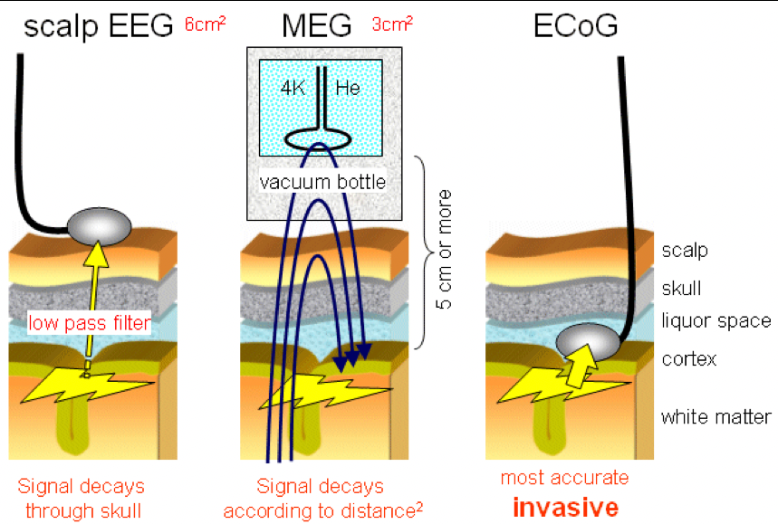

---

## Local Field Potential (LFP)

- LFP amplitude and frequency tell us about the amount of coordinated activity in a population of neurons.

## Measuring "LFPs" in Humans

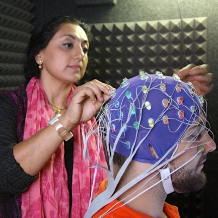

---

## EEG

- EEG works by putting electrodes on the surface of the scalp. The LFP that happens at the surface of the brain, despite filtered by the skin and the brain tissues and thus decayed dramatically, can still be measured by the sensitive electrodes. The neural signals are very weak, so they can only be measured when a lot of neurons are measured in coordination. There is a spatial filter: the signal gets spread over the whole skull, so it is impossible to tell where the signal arose from.
- Metal electrodes are attached to an elastic cap.
- Conducting gel is applied to connect electrodes to the scalp.
- EEG works the best for neurons that align perpendicular to the scalp.
- **Advantages:**
  - Excellent temporal resolution.
  - Relatively cheap. (The whole set up costs ~$30-40k, but once you have the set-up, per new subject you are only paying the gel, wires, electricity, etc.)
- **Disadvantages:**
  - Poor spatial resolution: if you know the source (what happens in the brain), you can predict the activity at the scalp. However, you cannot go the other way around: you cannot predict the source from the activity. (Analogy: shadows) It is mathematically impossible to do the counter-deduction.

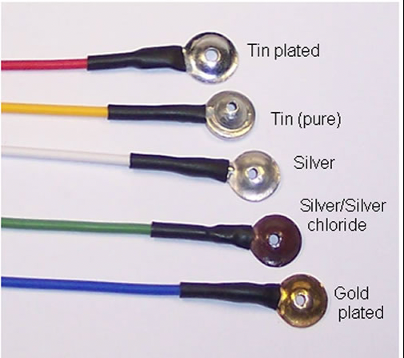

---

## MEG

- When there is an electrical current, there is a corresponding magnetic field. MEG measures the magnetic field generated by the electrical current. The sensor, rather than being put on the surface of the skull, is located outside and filled by liquid helium.
- SQUIDs located within the MEG dewar detect fluctuations in the magnetic field.
- MEG can better pick up on different types of sources from different brain regions that are oriented differently with respect to the scalp (and thus getting complementary information).
- **Advantages:**
  - Excellent temporal resolution.
  - Moderate spatial resolution. (Source reconstruction)
- **Disadvantages:**
  - Expensive. (Replacing liquid helium)

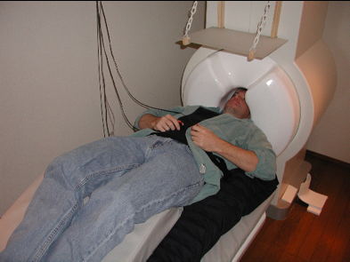

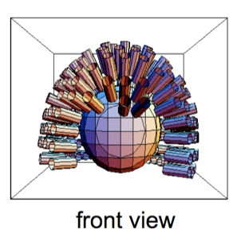

---

## M/EEG

Now what? How do we get meaningful info about the brain from the M/EEG signal?

1. Event-related averaging.
2. Decomposition: time-frequency analyses.

- The huge changes happened at the same time are probably muscle movements. (Make subjects try not to move.)

---

### 1. Event-Related Averaging

- Our goal is to measure neural signal, i.e., the brain's response to a particular stimulus or operation the challenge is that this signal is always embedded in noise.
  - What is noise?
    - The stuff that happening which we are not interested in measuring.
    - Noise is relative. (The noise in my experiment might be the measurement in your experiment.)
  - How do we remove it?
    - Eliminate outside interference as best we can. (Electrically-shielded rooms)
    - Experimental design.
    - **Signal averaging. (Noises will cancel out when averaging.)**

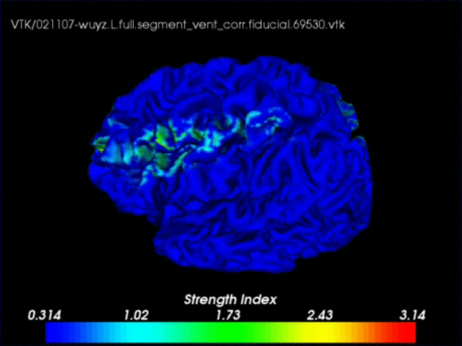

---

### 2. Time-Frequency: Decomposition

- Any continuous signal that varies in time can be thought of as a combination of sinusoids.
  - The signal can be decomposed into these sinusoids and we can study how each sinusoid changes as a function of mental function.

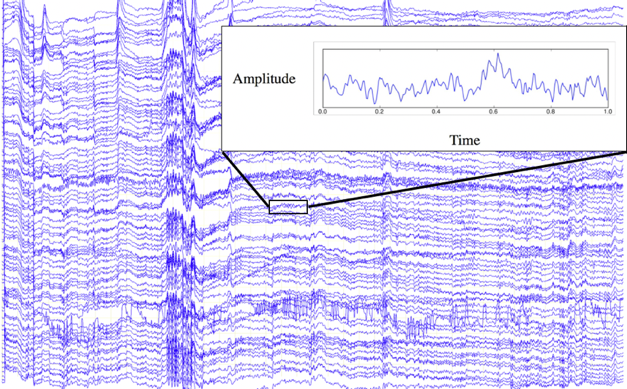

---

## M/EEG frequency bands

- M/EEG frequency bands:

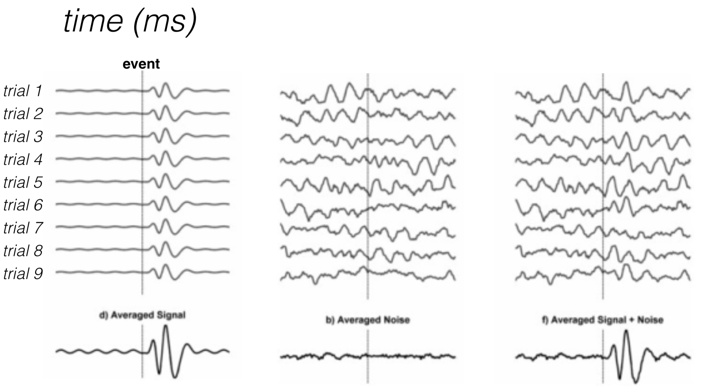

- It turns out that different frequency bands of the EEG signal are **physiologically meaningful**.
  - Gamma: action potentials.
  - Alpha: inhibitory processing.

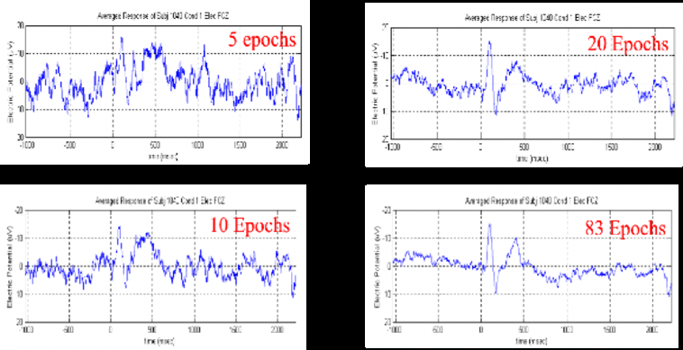

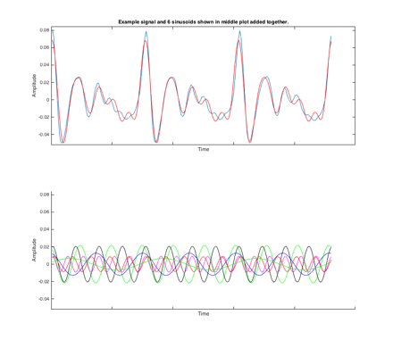

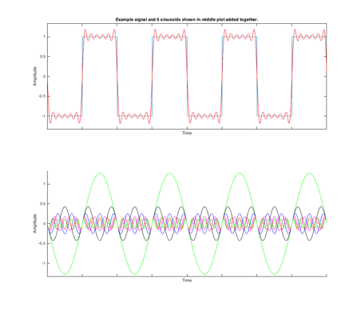
