# Long-Term Memory I: Cellular and Neural Basis (2021-11-18)

> Course: PSYCH-UH 2412 Cognitive Neuroscience | NYU Abu Dhabi | Authors: Sean Shan Guangji & Yumi Omori

---

## Memory in Broad Terms

### What is a memory?

- An experience-dependent change in behavior.
- From students: "Resurfacing representation about past events".
  - Counterargument: We do not need resurfacing (recalling) to call it a memory.
  - Memory could be representations of external events and internal feelings.

### What is not memory?

- Storage? DNA: biological storage which is not memory.
- Predictions? Some argue that it is prospective memory, but most people do not regard it as memory.
- Present experience? e.g., shivering. This is only based on present experiences but not prior experiences.
- Dreaming? However, they are built on experiences. This links to the topic of perception:
  - Perception cannot exist without memory, but it is not memory.

### What is a memory system?

- The set of processes and operations that allow us to encode, store, and recall specific types of information.
  - Determined by the functional and structural organization of our brains.

---

## Memory & The Brain

### What is a memory in the brain?

- LTM: An experience-dependent structural change.
- Memory is not so much a result of this structural change as it is this structural change.
  - Clarification:
    - Structural changes which are not experience-dependent:
      - e.g., During development (or aging), there are timing-dependent structural changes that happened in the brain — they are not memory.
    - Experience-dependent changes which are not structural:
      - e.g., There are changes in the activity but not the wiring of the brain. e.g., circadian rhythms.

- **Macro-level**: LTM relies on structural change in the medial temporal lobes (MTL).
- **Micro-level**: specifically, memory is the change in the connection between neurons. (Cellular-based)
  - Long-term potentiation (LTP): one mechanism that neurons undergo experience-dependent changes in connection.
  - LTP-dependent learning/memory requires NMDA receptors.

---

## Macro Level

### Memory & Brain Damage: HM

- Henry Molaison (1926-2008)
  - Treat seizure; bilateral temporal lobectomy (lobe resection) resulted in profound amnesia.
- Relatively spared remote memory.
  - Able to remember anecdotes and facts from childhood, e.g., who was president in 1938.
- Profound anterograde amnesia (remote event amnesia; sequential/forward amnesia).
  - Unable to form new LTM. "Frozen in time."

### The MTL and LTM

- MTL critically important for LTM.
- The picture below: patient HM vs. normal controls.

| Abbreviation | Structure | Chinese | Function |
|---|---|---|---|
| — | Lateral ventricle | 侧脑室 | Filled with CSF (cerebrospinal fluid) |
| — | Thalamus | 丘脑 | Relay motor & sensory signals to cerebral cortex |
| A | Amygdala | 杏仁体 | Emotion & Memory |
| H | Hippocampus | 海马体 | Learning & Memory |
| EC | Entorhinal cortex | 内嗅皮层 | Memory & Navigation & Time perception |
| RS | Rhinal sulcus | 嗅脑沟 | — |
| PC | Perirhinal cortex | 鼻周皮层 | Receive highly processed sensory information from all sensory regions & Region for memory |
| PHC | Parahippocampal cortex | 海马旁皮质 | Memory formation (e.g., hippocampus) & High-level visual processing (e.g., fusiform cortex) |

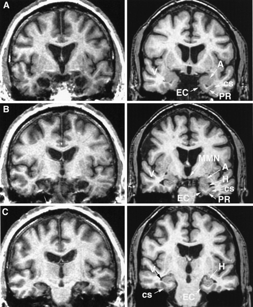

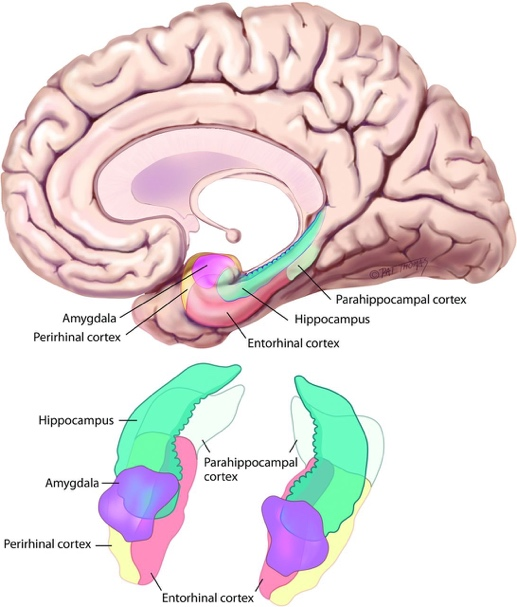

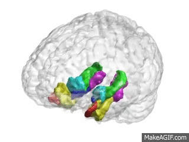

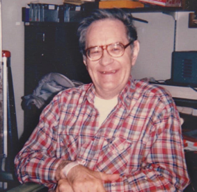

---

## Micro Level

### LTP: An Example of Memory

- Specifically, memory is the change in the connection between neurons.
- Neurons A and B have a synapse. We stimulate neuron A and record from neuron B.
  - This can be done in slices, e.g., hippocampal slice.
- The change (strengthening) in connection would be represented by the fact that the same stimulation in neuron A leads to a different (greater) response in neuron B.
  - Initially, every time you stimulated neuron A, you got approximately the same magnitude of response in neuron B at somewhere around 0.1mV.
  - Then, after giving neuron A a tetanus (repeated high-frequency stimulations), neuron B responded twice as large (0.2mV) to the same single stimulation to neuron.
    - We do not care about neuron B's response to tetanus itself.
    - Tetanus mimics the brain process of making the memory.
- This strengthening (potentiation) is long-lasting (even after two hours or longer).

---

*Below are notes from biopsychology.*

---

### NMDA Receptor & Coincidence Detection (Notes from Biopsychology)

- A glutamate receptor (which has an Mg²⁺ ion stuck in its channel).
- Requires both bindings of glutamate and depolarization (activation of the cell).
- If neuron A is active, it releases glutamate at the synapse which binds to the NMDA receptor of neuron B and opens the channel.
  - However, the Mg²⁺ ion is still stuck in the channel: despite being open, nothing can pass through the channel.
- If neuron B is active, the positive charge inside the cell has a repulsive effect on the Mg²⁺ ion. The electrostatic force kicks out the Mg²⁺ ion.
  - However, the NMDA channel remains closed because there is no glutamate.
- Therefore, the NMDA receptor needs both neuron A and neuron B to be active, thus known as the "coincidence detector".
- Critical for learning & memory.

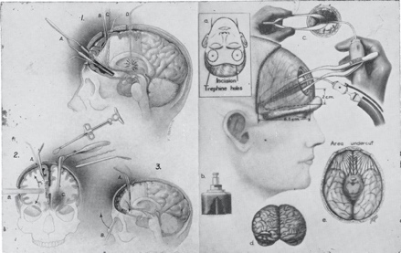

### What are the mechanisms underlying LTP?

1. High frequent presynaptic stimulation → AMPA + NMDA co-activation.
2. NMDA receptor activation → Influx of Ca²⁺.
3. Changes via 2nd messengers.
   - Increase in AMPA receptors. (Early-stage)
   - Retrograde signaling → Increase in NT release. (Early-stage)
   - Gene expression → Long-lasting changes and further increases in AMPA. (Late-stage → Permanent)

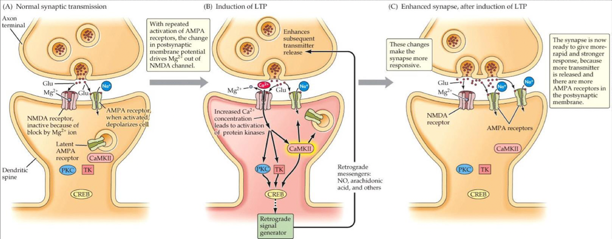

---

### From the Carleton University Video on LTP (Shown in Class)

- **Long-term potentiation (LTP)** is the cellular and molecular underpinnings of memory.
- LTP is a long-lasting enhancement in signal transmission between two neurons after repeated stimulation.
- On the postsynaptic cell are both NMDA and AMPA receptors. These receptors are usually localized together at many postsynaptic sites that are activated after the binding of the neurotransmitter glutamate.
  - The AMPA receptor is permeable to sodium ions.
  - The NMDA receptor is also permeable to sodium; but, more importantly, it has a high permeability to calcium. The NMDA receptor is also blocked by magnesium which prevents the ions from passing through the receptor.

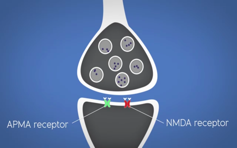

- When an action potential travels down the axons of the presynaptic neuron, it leads to the release of glutamate which binds to both the NMDA and AMPA receptors.
- When a low-frequency action potential is propagated down the axon of the presynaptic neuron, a small amount of glutamate is released.
  - The AMPA receptors will open and allow an influx of sodium into the postsynaptic cell. This causes a slight depolarization event in the postsynaptic cell.
  - The glutamate also binds to the NMDA receptor, but no ions will pass through the pore due to the magnesium blockade.
- While the small amount of neurotransmitter release signals a response, it is NOT enough to cause LTP.
- This is comparable to studying material only a few times. You will not activate a high-frequency action potential from studying for just a short while.

---

- When a high-frequency action potential travels down the presynaptic neuron to the terminal, a larger amount of glutamate is released.
- This is comparable to you studying for longer periods. This results in higher frequency action potentials.
- When glutamate binds to the AMPA receptor, a greater depolarization event occurs.
  - The AMPA receptors remain open longer due to the increased concentration of glutamate which allows a larger amount of sodium to enter through the AMPA receptors.
  - This influx of sodium causes a large depolarization event in the postsynaptic cells which repels the magnesium blockade from the NMDA receptor through electrostatic repulsion.

- At this point, the NMDA receptor with glutamine bound allows sodium and calcium to enter through its pore.
  - NMDA receptors are coincidence detectors because they require a presynaptic AND postsynaptic event for channel opening: the binding of presynaptically-released glutamate and a significant postsynaptic depolarization via activation of the AMPA.

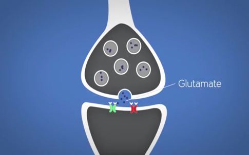

- LTP is the process of strengthening the connections between two neurons.
- The influx of postsynaptic calcium acts as an important secondary messenger activating many secondary intracellular cascades.
- The increase in calcium contributes to two phases of LTP: **early phase** and **late phase**.
- During the early phase, the calcium binds to its respective binding proteins and causes the insertion of new AMPA receptors onto the postsynaptic cell membrane at the synapse.
  - These AMPA receptors are stored in the postsynaptic cells' internal cell-stores and will only insert when there was a large influx of calcium through the NMDA receptor. This allows more AMPA receptors to be available for future depolarization events.

- The early phase changes last for only a few hours and require a brief increase in calcium levels.
- During the late phase, a prolonged influx of calcium causes an increase in transcription factors, ultimately resulting in gene expression and new proteins being synthesized. Some proteins resulting from this process include AMPA receptors which are inserted into the postsynaptic cell membrane at the synapse.

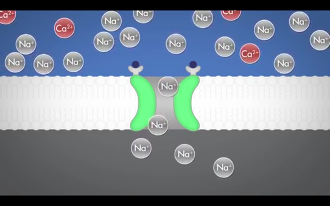

- In addition, there is an increase in the synthesis of proteins called growth factors. These are involved in the formation of new synapses which is the basis for synaptic plasticity — your brain can change as you learn. The formation of synapses allows for a stronger connection between the two neurons.

- The late phase changes can last 24 hours up to a lifetime.
- LTP is NOT a mechanism.
- It is an outcome of the increased activity between two neurons.
  - This results in an increase in AMPA receptors and synaptic connections which allows the low-frequency action potential to cause a greater depolarization event in the postsynaptic terminals.
- This is the foundation of memory.
- However, the hippocampus is not the only brain region that processes memories. Memory processing occurs in many other regions including parts of the cerebral cortex.
- Studying activates various pathways throughout the entire brain. Continuous activation of the same pathways will create high-frequency presynaptic action potentials and postsynaptic activation in those paths. It is now clear that these pre- and post-synaptic events strengthen the connections in the specific pathway. This strengthening is what contributes to the ability to recall the material in the exam.

---

*End of the notes from biopsychology.*

---

### Three-panel Summary Diagram of LTP

---

## Memory, LTP, and NMDA

*(Below are contents about how LTP could lead to actual behaviors.)*

- AP5 is an NMDA antagonist / pharmacological blockade of NMDA receptor disrupted LTP.
  - Normal control — got LTP. AP5 — failed to get LTP. Inactivated version — got LTP.

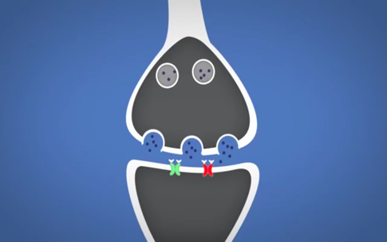

- AP5 is given to wake-behaving mice. The experimenters then watch the behaviors of these mice. (Morris et al., 1986)
- In this case, researchers remove the platforms of the water maze. The poor mice in the group that formed the memory spent all the time swimming near the top right corner, thinking where is the platform.
- Researchers can turn the circle into four quadrants and compare how much time the mice spent in the right quadrant compared to the other quadrants.

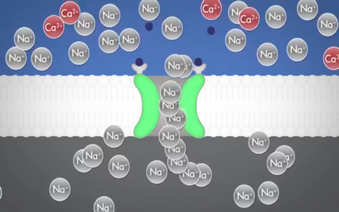

- Critically, NMDA blockage disrupted performance on the water maze task.
  - Inhibiting the NMDA receptor both blocks the LTP and prevents the formation of memory behaviorally — the circumstantial evidence that LTP and behavioral evidence are related.
  - Cannot learn → Unable to have changes in behaviors as a function of learning and experience.
- **Conclusion**: NMDA receptor activation is essential for LTM.

---

## (Incomplete) Taxonomy of Memory

![Taxonomy of memory systems — hierarchical diagram: Memory systems split into Long-term memory and Short-term memory (working memory). Long-term memory splits into Declarative (explicit) and Nondeclarative (implicit). Declarative splits into Episodic and Semantic. Nondeclarative splits into Skill learning (procedural), Priming, Classical conditioning, Nonassociative learning, and Spatial memory. Brain regions listed at bottom: Episodic → Hippocampus, medial temporal lobe, neocortex; Semantic → Lateral and anterior temporal cortex, prefrontal cortex; Procedural → Striatum, motor cortex, cerebellum; Priming → Neocortex; Classical conditioning → Amygdala and cerebellum; Nonassociative learning → Reflex pathways; Spatial memory → Hippocampus and cortex; Working memory → Sensorimotor and prefrontal cortex](images/pdf2-350.png)

![Subtypes of declarative and nondeclarative memory — diagram: Long-term memory splits into Declarative (things you know that you can *tell* others) and Nondeclarative/procedural (things you know that you can show by *doing*). Declarative splits into Episodic (remembering your first day in school) and Semantic (knowing the capital of France). Nondeclarative splits into Skill learning (knowing how to ride a bicycle), Priming (being more likely to use a word you heard recently), and Conditioning (salivating when you see a favorite food).](images/pdf2-351.png)
