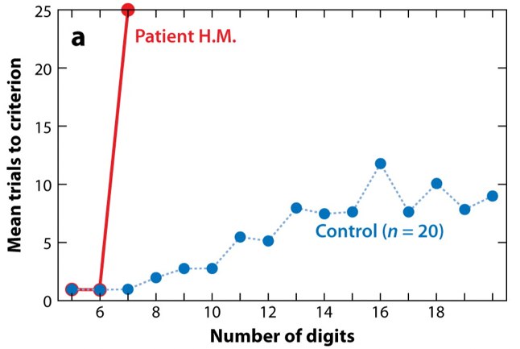
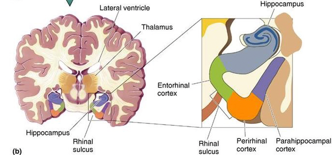
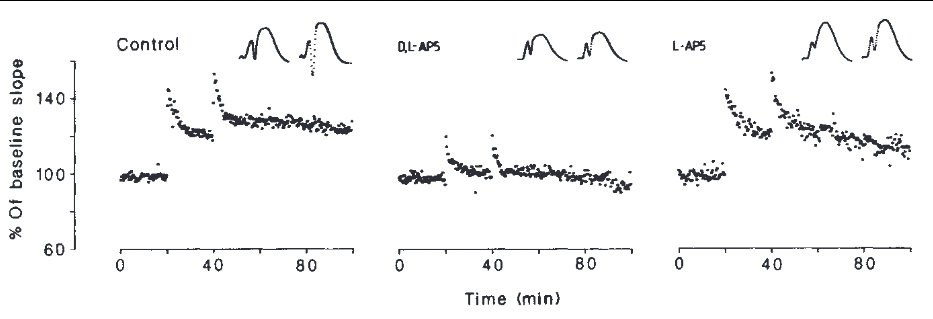
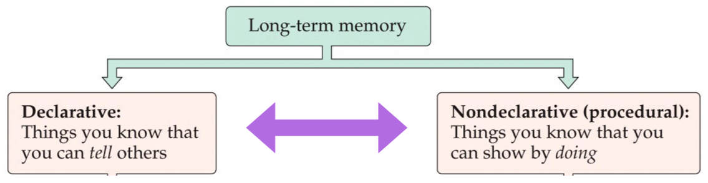
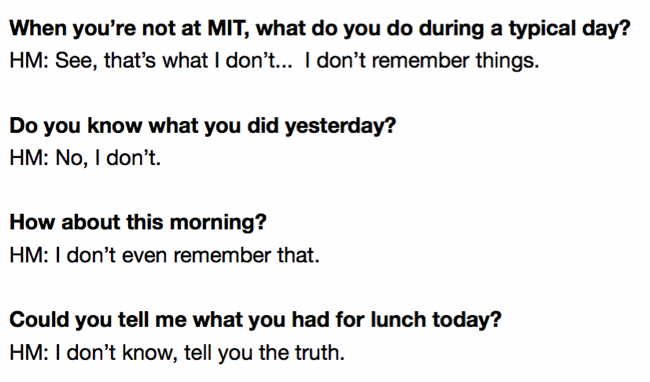
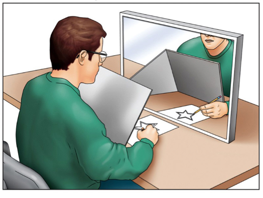
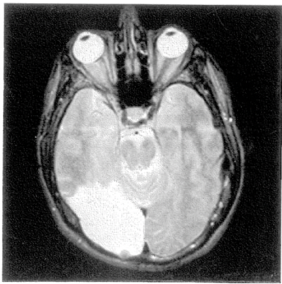

# Long-Term Memory II: Declarative Memory (2021-11-25)

> Course: PSYCH-UH 2412 Cognitive Neuroscience | NYU Abu Dhabi | Authors: Sean Shan Guangji & Yumi Omori

---

## Are These Distinctions Meaningful?

- Patient H.M. was fine in remembering things about 6 items in relatively small numbers of trials. However, he could not do anything above 6 items no matter how many trials he was getting.
- This suggests a distinction between WM and LTM where patient H.M.'s LTM was impaired but WM was spared.

**vs.**

- System's level: medial temporal lobe (MTL) vs. dorsolateral prefrontal cortex (DLPFC).

**vs.**

- Cellular level: long-lasting connection strengthening vs. fire persistently but undergo no long-term change.

- Note that the distinction above is not as simple, neat, and tidy as it seems.
  - There is prefrontal involvement in LTM, and there is hippocampal involvement in WM.
  - But LTM seems to be more MTL-dependent, and WM seems to be more prefrontal-dependent.

---

## Declarative vs. Non-Declarative Memory: Evidence from Patient H.M.

**[Half anecdotal & Half experimental:]**

> **When you're not at MIT, what do you do during a typical day?**
> HM: See, that's what I don't... I don't remember things.
>
> **Do you know what you did yesterday?**
> HM: No, I don't.
>
> **How about this morning?**
> HM: I don't even remember that.
>
> **Could you tell me what you had for lunch today?**
> HM: I don't know, tell you the truth.

- Mirror-tracing task: people use the visual feedback from the mirror (being reflected) rather than from the real-world, so they usually go in the wrong way when they first trained in the experiment.

- Did not have declarative memory vs. Learned the task over the course of the day.
  - (He had no recollection of the task. Every time, you need to reexplain the task rule to him.)
  - (When patient H.M. came back on the next day, he started essentially where he left off at the end of the previous day.)
- This suggests a distinction between declarative and non-declarative where the former was impaired but the latter was spared in patient H.M.

- Priming study: people, including patient M.S. (occipital lesion), controls, focal lesion patients, and amnesia patients, read a list of words.
  - Priming does not require repeated exposure, while conditioning requires repeated exposure.
- After some time, they saw the words briefly presented and had to identify the word and indicate whether it was from the previous list.

---

### Results of the Priming Study

- **Priming**: when you encountered the words that you have seen previously, you would be faster at responding to them.
- **Declarative memory**: accurate recognition of words as old or new.

![Two bar graphs [Left: priming; Right: declarative memory]. Left graph (A): Time to identify (msec), Y-axis 0–100, groups on X-axis: M.S., CON (control), FOC (focal lesion), AMN (amnesia). NEW words (white bars) vs. OLD words (dark bars). M.S. shows no priming effect (similar times for old/new); others show faster identification of old words. Right graph (B): Recognition (% correct), Y-axis 50–100. M.S. ~90%; CON ~90%; FOC ~90%; AMN ~70%. Shows intact declarative memory in M.S. but impaired in amnesia.](images/pdf2-394.png)

- Priming:
  - For patient M.S., seeing the word previous did not make a difference — there were no effects of priming.
  - In contrast, controls, as well as patients with focal lesions and amnesia, were faster at the old words than new ones.
- Declarative memory:
  - If you ask the participants what was old and what was new, patient M.S. was fine — recognizing almost 90%.
  - Patients with amnesia who had declarative memory issues only had closer to 70%.
- Here, it was a nice **double dissociation**:
  - Patients with amnesia have intact nondeclarative memory but impaired declarative memory.
  - Patients with occipital lesions have disruptive priming effects but spared declarative memory.

---

## A System-Level View of LTM

- What are the brain structures & operations involved in these three subprocesses of LTM?

---

## LTM Encoding

- How do we study the brain's involvement in LTM encoding?
  - We are constantly encoding facts and experiences into LTM. (Do not necessarily related to attention.)
  - Manipulating what is encoded and what is not is experimentally problematic and challenging (relative to WM).
- **Subsequent memory**: relate natural variations in LTM to brain activity during encoding. (Sorting these post-hoc)

### Subsequent Memory in the Brain

- Subjects were not told to form LTM.
- WM delayed recognition task for novel 3-D shapes, followed by a surprise recall for shapes from the task.
- Sort the result post-hoc: during the delayed interval, is there something different about the way the information is processed for something that was subsequently remembered versus something that was not?

- Activity during WM delays varied with subsequent memory.
  - Record: left DLPFC & left hippocampus.
- Evidence for the relationship between WM and LTM encoding.
  - For the correct trials, early on during the delay period, you see more activity in DLPFC and, especially, hippocampus.
  - Hippocampal activity during the WM period predicts incidental encoding into LTM.

---

## LTM Storage

- **Consolidation**: strengthening some part of the memory.
- MTL is unlikely to be heavily involved in the storage of LTM.
  - H.M. and other patients with MTL damage are able to recall facts and events from before their damage with great accuracy and detail.
  - Retrograde amnesia is common with dementias (dementia), which cause widespread cortical rather than MTL damage.

| MTL | Initially encoding information. & Transferring them into the cortex for storage. | Cortex | Storing the LTM. |
|---|---|---|---|

---

## LTM Retrieval: Interference & Dual-Process Models

### Testing Episodic in a Lab (An Example)

| Column 1 | Column 2 | Column 3 | Column 4 | Column 5 | Key |
|---|---|---|---|---|---|
| title | tissue | **trouble** | **water** | wonder | ■ Old Words |
| scissor | summer | **sailboat** | **trouble** | **summer** | ■ Words that have never appeared |
| brief | eraser | **glasses** | **bubble** | laser | ■ Prospective episodic interference (Experience that we had before) |
| stem | leaf | | **tree** | **leaf** | ■ Prospective semantic interference (Related meanings) |
| life | phone | | **phone** | **path** | ■ Retroactive interference (Experience that we had after) |
| part | hole | | berry | **hole** | |
| trail | path | | **eraser** | painting | |
| letter | railroad | | **railroad** | **train** | |
| bubble | dress | | **dress** | elbow | |
| sweater | cloud | | **cloud** | **scissor** | |
| river | water | | **tissue** | **sailboat** | |

- Did retrieval feel the same for each of these words?
- Were there some words that you felt much more confident were previously encountered?
  - **Recollection**: "I remember having seen that word in the previous list" — retrieval of specific details from memory.
  - **Familiarity**: "I have encountered this word before" — notion that the information was previously experienced in the absence of source details.
- Are these memories meaningfully different in the brain?

