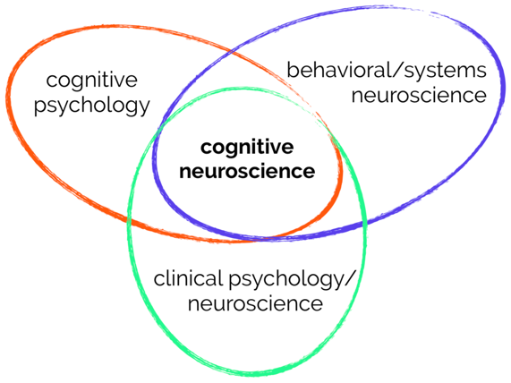
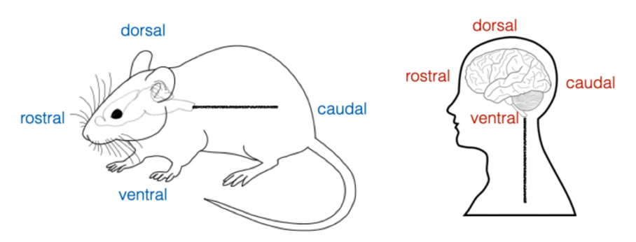
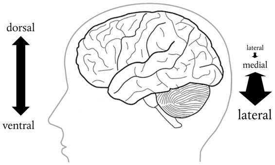
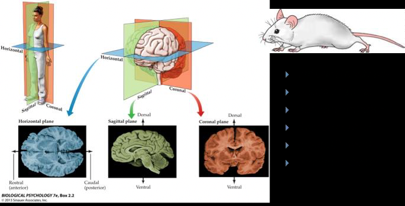

# Introduction to the Study of Mind and Brain; Brain Functions (2021-08-31)

> Course: PSYCH-UH 2412 Cognitive Neuroscience | NYU Abu Dhabi | Authors: Sean Shan Guangji & Yumi Omori

---

[← Back to Main Contents](../README.md) | [Next Lecture →](02-how-to-read-paper-lesion.md)

---

## What is cognitive neuroscience?

- Neuroscience with direct implications for understanding **human behavior** with an emphasis on **higher-order functions**.

  

*Venn diagram showing cognitive neuroscience at the intersection of cognitive psychology, behavioral/systems neuroscience, and clinical psychology/neuroscience*

- The question of **construct validity** will be important for every domain of behavior in cognitive neuroscience.
  - Construct validity is the extent to which the measure 'behaves' in a way consistent with theoretical hypotheses and represents how well scores on the instrument are indicative of the theoretical construct.

---

## Why should we take this course?

- There is a lot of information out there. To learn and value the truth, we need to be intelligent consumers of information.
  - We shall hold the truth in high regard, repeat them, and do not let rumors confuse the public opinion.
- The brain is fascinating!
  - E.g., The Human Fetus Preferentially Engages with Face-like Visual Stimuli.

---

## Key Languages Navigating the Brain:

  

*Diagram of anatomical planes: horizontal/axial, sagittal, and coronal cross-sections of the human brain and body*

  

*Mouse diagram showing anatomical directional terms: dorsal, ventral, rostral, caudal*

  

*Human brain sagittal diagram showing directional terms: dorsal, ventral, rostral, caudal*

  

*Human head profile with arrows indicating dorsal/ventral and lateral/medial directions on the brain*

**Key anatomical orientation terms:**

- **anterior/posterior**
- **rostral/caudal**
- **superior/inferior**
- **dorsal/ventral**
- **medial/lateral**
- **proximal/distal**

  

*Three reference brain scan images: axial/horizontal view, sagittal view, and coronal view*

| Term | Chinese Translation |
|------|-------------------|
| Axial / Horizontal | 横断 (Transverse section) |
| Sagittal | 矢状 (Sagittal section) |
| Coronal | 冠状 (Coronal section) |
| Anterior/Posterior | Front/Back |
| Rostral/Caudal | Near the head / Near the tail |
| Superior/Inferior | Up/Down |
| Dorsal/Ventral | Dorsal side / Ventral side |
| Medial/Lateral | Middle / Lateral |
| Proximal/Distal | Near end / Far end |

  

*Diagram showing dorsal and ventral directions on a rodent body*

  

*Diagram showing rostral, caudal, dorsal, and ventral directions on the human brain from a lateral view*

---

## (Continued from page 10) Key Neuroscience Concepts

- The motor control research introduced the principle of **topographic representation**, that adjacent parts of the body can be represented on adjacent parts of the cerebral cortex.
  - The principle of **somatotopy** is that adjacent parts of the body (for example, the upper lip and the nose) are represented in adjacent parts of the brain.

---

## What is a brain function?

- Is thinking a brain function?
- Is eating a brain function?
- Is eating a sandwich a brain function?
- Is eating a cheese sandwich versus a turkey sandwich a brain function?

- It depends! What we define as a brain function depends on the **level of analysis** that we are interested in.
- There are virtually limitless sets of behaviors that the brain can do.
  - We may group them into some arbitrary human-defined groups. (eating → decision making & motor behaviors)
  - We may parse them down and make a fine-grained analysis. (sandwich → turkey vs. cheese sandwich)
  - But there is some level at which it is useful to distinguish and some level at which is not. (detailed but not too trivial)
    - The distinction between turkey/cheese does not help people glean more information about how the brain works.
  - When thinking about the brain function, we are thinking about grouping together at some level of analysis that gives us insight into how the brain actually works.

---

[← Back to Main Contents](../README.md) | [Next Lecture →](02-how-to-read-paper-lesion.md)