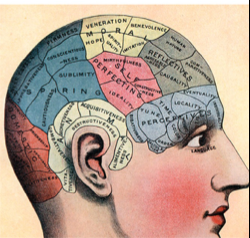
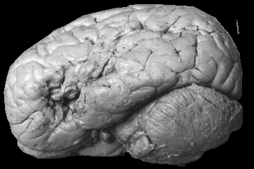
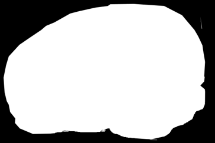
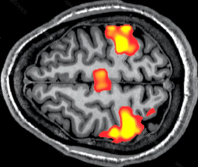
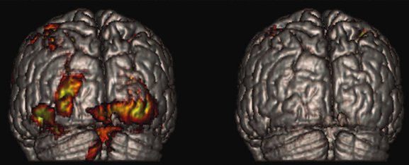
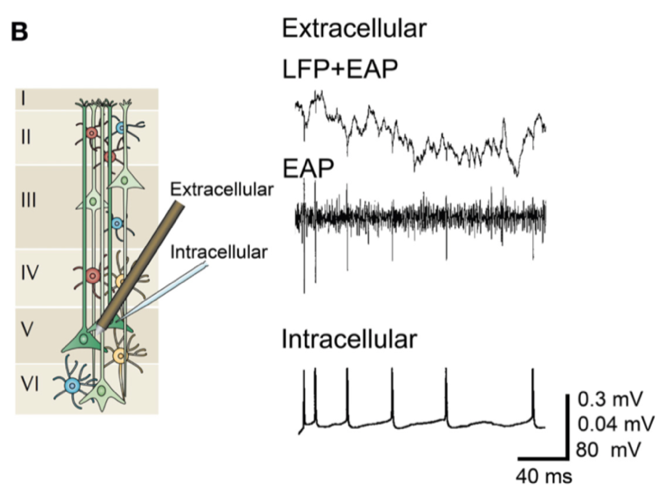
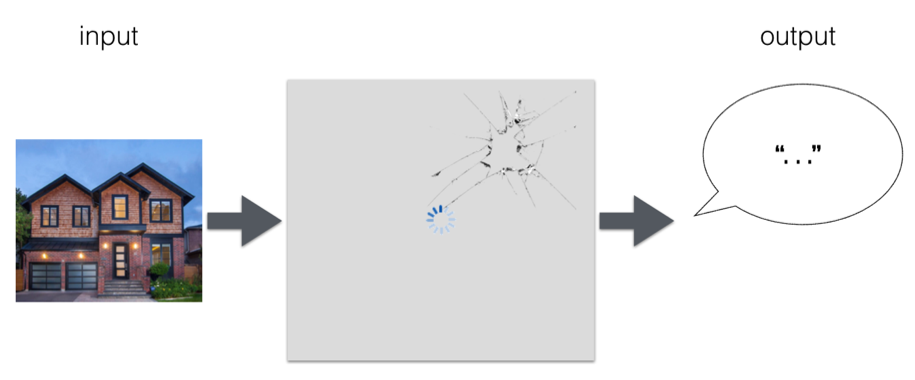
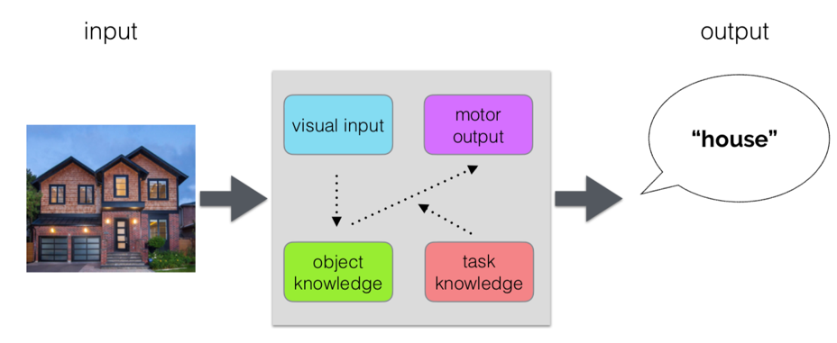

# How to Read a Paper; Key Neuroscience Concepts; The Lesion Method (2021-09-02)

> Course: PSYCH-UH 2412 Cognitive Neuroscience | NYU Abu Dhabi | Authors: Sean Shan Guangji & Yumi Omori

---

[← Back to Main Contents](../README.md) | [← Previous Lecture](01-introduction-mind-brain.md) | [Next Lecture →](03-lesion-demonstration.md)

---

## How to read a paper?

- If skimming, read 1st paragraph of the discussion.
- If reading just for informational purposes, read in order.
- If reading with the intent to critically evaluate:
  - **Title**
  - **References**: give an idea of what the paper is about; will not work as well if you are unfamiliar with the field.
  - **Abstract**
  - **Methods**: (from the abstract and references, I should have an idea of how they are going to perform the experiment.)
  - **Results**: (from methods and abstract, I should have an idea of what the results are.)
  - **Intro**
  - **Discussion**

---

## Paper 1: How to Read a Paper 1

*The Three Pass Approach*

### First (general idea):

- **Steps:**
  - Carefully read the title, abstract, and introduction. *(Carefully read the title, abstract, and introduction)*
  - Read the section and sub-section headings, but ignore everything else. *(Read section headings only)*
  - Glance at the mathematical content (if any). *(If there are mathematical formulas, skim them)*
  - Read the conclusions. *(Read the conclusions)*
  - Glance over the references. *(Scan the references)*
- **Take-aways:**
  - Category (type of paper) — *Type of paper*
  - Context (what other paper it related to) — *Background/context (topic)*
  - Correctness (whether assumptions are valid) — *Correctness (validity of assumptions)*
  - Contributions (main findings) — *Contributions (conclusions)*
  - Clarity (whether it is well-written) — *Clarity*

### Second (content):

- **Methods:**
  - Read the paper with great care, but ignore details such as proofs. *(Read carefully, but ignore proofs)*
  - Note down terms that you do not understand, or questions you may want to ask the author. *(Note down thoughts/questions)*
  - Look carefully at the figures, diagrams, and other illustrations. *(Look carefully at figures)*
  - Mark relevant unread references. *(Record unfamiliar references)*
- **Outcomes:**
  - Grasp the content; summarize the main thrust. *(Grasp the main content)*

### Third (understand in depth):

- **Key**: virtually re-implement the paper — understand not only its innovations but also its hidden failings and assumptions.
  - Identify and challenge every assumption. *(Identify and analyze assumptions)*
  - Think about how you would present a particular. *(Think about how you would present the data)*
  - Jot down ideas for future work. *(Think about future research directions)*
- Be able to pinpoint implicit assumptions, missing citations, and potential issues with experimental and analytical techniques.

---

## Paper 1 (continued): Doing a Literature Survey

- First, use an academic search engine (Google Scholar or CiteCeer) to find 3–5 recently highly-cited papers. *(Search for frequently-cited papers)*
  - If lucky, may find a recent survey paper.
- Second, find shared citations and repeated author names in the bibliography. *(Identify core papers in the field)*
- Third, go to the website of these top references and look through their recent proceedings. *(Follow core breakthroughs in the field)*
  - If they all cite a paper that you did not read earlier, obtain and read it, iterating as necessary.

---

## Paper 2: How to Read a Paper 2

### General Questions *(Broad thinking)*

- What does the proposed research contribute to our knowledge of human nature? — *Is it useful to humanity?*
- What is the source of the publication? — *Source?*

### The Introduction *(When reading the introduction/overview)*

- Is there good support (reasoning) for the prediction(s) the research is making? — *Is there factual/logical support?*
- Does the researcher differentiate between "empirical findings based on research" and "theoretical best guesses based on experiences"? — *Does it distinguish "experimental empirical findings" and "empirical best-guess judgments"?*
- Does the author present any counter-arguments, and how does he refute them? — *Are counter-arguments presented and explained?*
- Are assumptions reasonable or stereotypical? — *Are assumptions reasonable or full of stereotypes?*

### The Method *(When reading the experimental methods)*

- Can you think of how to do it better? — *Is there room for improvement?*
- **Participants**: Who are they? Can the researchers generalize from their sample? — *Participants: Is it generalizable?*
- **Materials**: What is their instrument? — *Experimental materials:*
  - Are the questions leading? — *Are the questions biased/leading?*
  - Does the instrument reliably measure the dependent variable? — *Does it reliably measure the dependent variable?*
- **Design**: Does their design effectively test the proposed hypothesis? — *Experimental design: Does it effectively test the hypothesis?*
  - If the design is experimental, is there a control group? — *If experimental, is there a control group?*
  - How effective will the proposed manipulation of the independent variable be at producing the desired results? Are there any confounds? — *Is the control of the independent variable effective? Are there confounds?*
- **Procedure**: — *Experimental procedure:*
  - Is it ethical? — *Is it ethical?*
  - Is it complete? Is it replicable? — *Is it complete? Is it replicable?*

### The Results *(When reading the experimental results)*

- Does each condition have sufficient participants to yield reliable results? — *Is the sample size sufficient?*
- Does the data support the hypothesis? Did they do correlation/ANOVA? — *Do the data and analysis support the hypothesis?*
- Are the significant differences interpreted clearly? — *Are between-group significant differences clearly interpreted?*
- Do they give all the results they are able to? — *Is all the data provided?*

### The Discussion *(When reading the discussion/analysis)*

- Do they provide adequate interpretations of all analyses done? — *Is the analysis interpretation sufficient?*
- Are their interpretations supported by the data or ad hoc? — *Is the analysis supported by data?*
- Do they infer causation from correlation? — *Do they over-infer causation?*
- Do they discuss other possibilities and alternative explanations? — *Are other factors that could bring about these results discussed?*
- Do they identify possible threats to the validity and generalizability? — *Is validity and generalizability threatened?*
- Do they state the implications? How can it be applied to the real world? — *What are the real-world applications?*

### References *(When reading the references)*

- Any empirical articles from reputable journals? — *Are the journals reputable?*
- Is everyone they cite in the paper also cited in the reference? — *Is every citation marked?*

---

## Localization vs. Mass Action

### Localization

- **Localization**: mental functions can be localized to circumscribed areas of the brain.
  - The principle of localization of function refers to the idea that different aspects of brain function, such as visual perception vs. the control of our emotions vs. our talents as musicians, are governed by, and therefore localizable to, different "centers" in the brain.

### Mass Action

- **Mass action**: mental functions are distributed across several brain regions.
  - A particular function can't necessarily be localized to a specific area of the brain, and, conversely, any given area of the brain can't be thought of as a "center" that is specialized for any one function.
  - For example, there is no language/vision/attention region.
  - **Equipotentiality** (an extreme perspective): all parts of the brain are equally able to perform a given function.

---

## Localization:

### Phrenology (~1820)

- Personality is predicted from bumps on the scalp.
- Localization of function taken to an extreme conclusion.

  

*Phrenology head diagram showing personality trait regions mapped to areas of the skull*

### Lesions

- Function can be inferred by examining patients with brain lesions.

  

*Lateral view of the human brain showing cortical regions*

### Neuroimaging (~1990)

- Functions can be associated with brain activity measured in behaving animals.

  

*Brain scan showing activation (colored regions) during finger-tapping mission — an example of neuroimaging localizing brain function*

*(Finger-tipping mission)*

---

## Mass Action:

### Lashley and the Engram (~1940)

- **Amount of damage, not location of damage, predicted memory deficits.**
  - In Lashley's experiments, rats were trained to run through a maze, and then tissue was removed from their cerebral cortex. Increasing the amount of tissue removed increased the degradation of memory, but more remarkably, where the tissue was removed from made no difference.

  

*Grid chart of Lashley's maze experiment data showing increasing memory deficit with increasing amount of cortical tissue removed, regardless of location*

### Neuroimaging

- Activity associated with a function can be **plastic** and **distributed**.
  - **In blind subjects, the occipital lobe is activated when touching things.**
  - The networks span largely across the brain.

  

*Brain scans showing distributed network activation — occipital lobe activity in blind subjects during tactile tasks*

  

*Colored connectivity map of the brain showing large-scale distributed neural networks*

---

## Key Neuroscience Concepts (continued from the lesion method lecture)

### Neurological Patients

- **Left**: hydrocephalus, cerebrospinal fluid (CSF) builds up in the ventricle, but have a relatively normal IQ.
- **Right**: traumatic injury, coma, with impaired brain function.

  

*Brain CT scans: left showing hydrocephalus with enlarged ventricles; right showing traumatic brain injury*

  

*Additional brain scan images of neurological patients*

---

## Electrochemical Communication

### The Action Potential

- Use recording electrode; APs recorded as "spikes" by extracellular electrodes.
- Spike frequency tells us about the activity of a neuron.

  

*Diagram of action potential waveform (showing resting potential ~-70mV, depolarization to +30mV) and spike train recording showing increasing spike frequency*

### Local Field Potential: (summed post-synaptic potentials)

- Because the dendritic branches from many, many neurons are located in close proximity to each other, it is typically not possible to isolate the fluctuations attributable to a single neuron.
- Rather, what is recorded is the **local field potential (LFP)**, a reference to the fact that it's the local region of cortex where these dendrites are located (i.e., the "dendritic field") from which the signal is being measured.
- **LFP amplitude and frequency tell us about the amount of coordinated activity in a population of neurons.**

  

*Diagram (Panel B) showing a cortical column with layers I–VI, illustrating extracellular recordings including LFP+EAP signal and EAP alone, compared with intracellular recording; shows signal amplitude scale of 0.3 mV, 0.04 mV, 80 mV and timescale of 40 ms*

- **From the professor:**
  - What we record from extracellular electrodes is the signal which includes both the LFP and the APs as measured extracellularly. They are already added, and we need to decompose them in order to look at each one separately.
  - To do so, we need to filter the signal we measure.
    - The high frequency component of the signal represents the APs.
    - The lower frequency component of the signal represents the LFP.
  - People often are recording two APs from two neurons that occur at the same time. Complex spike-sorting algorithms are needed to demix this signal to identify APs that go with particular neurons.
- The net effect on a neuron receiving different types of neurotransmitters that can be released at different moments in time is that its **membrane potential oscillates**.
- Across regions, **oscillatory synchronization** of ensembles of neurons is necessary if they are to effectively communicate.

---

## The Lesion Method

### What is a Craniotomy?

- **Craniotomy**: surgical procedure of removing a portion of the cranium (skull) in order to expose a portion of the underlying brain tissue.

### The Logic of the Lesion Method

  

*Diagram showing the lesion method logic: top — input (image of a house) → damaged/lesioned brain (black box with broken connections) → output (no verbal response, indicated by "..."); bottom — input (image of a house) → intact brain with labeled components (visual input, motor output, object knowledge, task knowledge) → output ("house")*

  

*Continuation of the lesion method diagram showing the intact brain's internal functional components: visual input, motor output, object knowledge, and task knowledge, linking input to correct output "house"*

### Advantages and Disadvantages

| **Advantages** | **Disadvantages** |
|---|---|
| The logic behind the method is straightforward. | Challenges to implementing. |
| Support strong inferences about the localization of brain function. | At the whim of nature (in humans at least!): some damage is more common (e.g., stroke); no two patients are exactly the same. |
| (Not only **involvement** but also **necessity**.) | Rely on the localization assumption — across individuals and time; does not account for white matter damage. |
| | Finding an appropriate control group is challenging. |

  

*Diagram illustrating advantages of the lesion method: straightforward logic and ability to support strong inferences about brain function localization*

  

*Diagram illustrating disadvantages of the lesion method: challenges to implementing, at the whim of nature, reliance on localization assumption, and difficulty finding appropriate control group*

---

## Paper 4: Using Human Brain Lesions to Infer Function: A Relic from a Past Era in the fMRI Age?

> See detailed content on P24.

---

[← Back to Main Contents](../README.md) | [← Previous Lecture](01-introduction-mind-brain.md) | [Next Lecture →](03-lesion-demonstration.md)