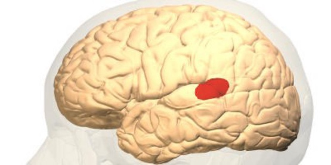
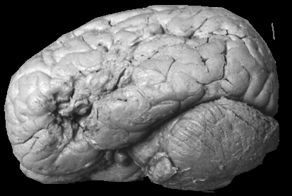
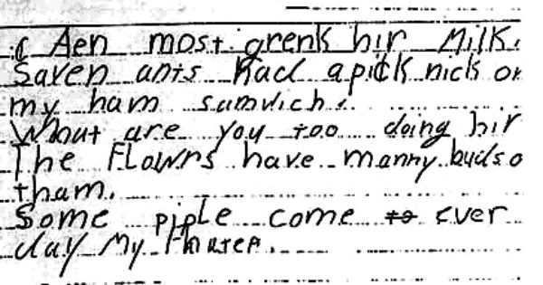

# Lesion Demonstration (2021-09-07)

> Course: PSYCH-UH 2412 Cognitive Neuroscience | NYU Abu Dhabi | Authors: Sean Shan Guangji & Yumi Omori

---

[← Back to Main Contents](../README.md) | [← Previous Lecture](02-how-to-read-paper-lesion.md) | [Next Lecture →](04-bechara-discussion.md)

---

## Wernicke's Aphasia — *Can't understand (no awareness) but can speak (no motor problem)*

- **Inability to assign meaning to language.**
- **Spared language production** but usually with **loss of meaning**.
  - If you weren't paying close attention to their speech, you might not know they had an issue.
- **Spared non-language intellectual capabilities; spared motor functions.**
- May also display "**press of speech**": don't pause to allow others to speak.
- May get frustrated with others due to **lack of awareness** of difficulties.
- Typically due to damage to **left posterior superior temporal gyrus**, "Wernicke's area".

  

*Portrait photograph of Carl Wernicke, the neurologist who first described Wernicke's aphasia*

  

*3D rendered brain showing the location of Wernicke's area highlighted in red on the left posterior superior temporal gyrus*

  

*Photograph of a real human brain specimen showing the left hemisphere with the posterior superior temporal region associated with Wernicke's aphasia*

---

## Broca's Aphasia — *Can understand (has awareness) but cannot speak (motor problem)*

- **Partial or complete loss in the ability to produce language.**
  - More difficulty with verbs than nouns, more difficulty in writing than reading.
- "**Telegraphic speech**": word by word.
- **Comprehension is usually spared.**
- **Have motor issues.** (not primary motor cortex, but more advanced areas)
- May get frustrated with themselves (and depressed) due to **awareness** of difficulties.
- Typically due to damage to the **left posterior inferior frontal gyrus**, "Broca's area".

  

*Portrait photograph of Paul Broca, the surgeon and anatomist who first described Broca's aphasia*

  

*3D rendered brain showing the location of Broca's area highlighted in red on the left posterior inferior frontal gyrus*

  

*Photograph of a real human brain specimen showing the left hemisphere with the frontal region associated with Broca's aphasia*

---

## Handwriting Comparison: Wernicke's vs. Broca's Aphasia

- **Left (Wernicke's aphasia)**: fluent writing with runs of words, but the content is largely meaningless or jargon-filled.
- **Right (Broca's aphasia)**: sparse, telegraphic writing — individual words with great effort (e.g., "Ciga- the smoke it, comb. Hair, Fork. The eat out, Key. the unlocks, Knife.- Butter up. Match Light Fires, Pen. Write Letter, Pencil Write and Erasing").

  

*Handwriting sample from a patient with Wernicke's aphasia: fluent cursive text that reads as flowing prose but lacks meaningful content — "c Aen most grenk bir Milk, Saven ants Kacl a pick nicks on my ham sandwich, What are you too doing bir, The Flowrs have manny buds o tham, Some piple come to ever day My Inurep."*

---

## Neglect / Extinction

### Neglect

- **Neglect**: deficit in the ability to attend to a side of the visual field.
  - **They can see things, but paying attention to them is challenging.**
  - Can direct to themselves or direct externally.
  - e.g., people who shave one side of their face.

### Extinction

- **Extinction**: lack of awareness of **contralesional stimuli** when paired with **ipsilesional stimuli**.
  - If you have damage on the right side, you will have a lack of awareness on the left side when objects appear on both the left side and the right side of the visual field.
  - There is a **competition** among the two sides.
  - Deficits in **global processing**. (They can see the trees, but not the forests.)
  - Typically due to damage to the **right parietal cortex** (and thus the neglect/extinction on the left field).

  

*Brain MRI axial scan series showing two patients (UNP2 at slices 7–27; UNP3 at slices 21–41) with right parietal cortex lesions that cause left-sided neglect and extinction*

---

## Other Information

- Infantile reflexes seem to be released by frontal lobe damages — these patients seem to go back to primitive reflexes.
- For lesion patients, is that they are being watched and feel anxious a problem?
  - Probably not, because the objects only suck at what they are impaired (though confirmation bias might be a problem) but perform well in their spared functions.

---

[← Back to Main Contents](../README.md) | [← Previous Lecture](02-how-to-read-paper-lesion.md) | [Next Lecture →](04-bechara-discussion.md)