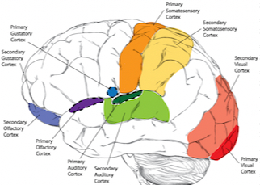
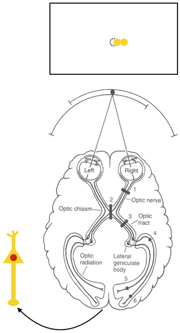
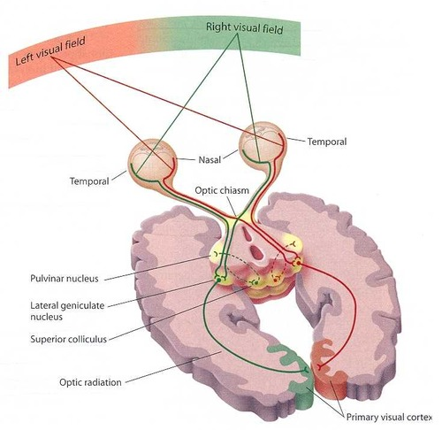
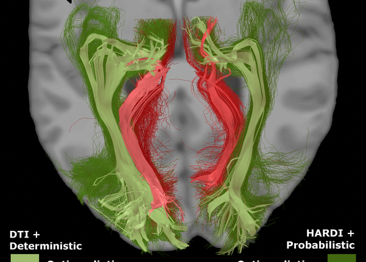

# High-Level Vision I: How Do We Perceive? (2021-09-14)

> Course: PSYCH-UH 2412 Cognitive Neuroscience | NYU Abu Dhabi | Authors: Sean Shan Guangji & Yumi Omori

---

[← Back to Main Contents](../README.md) | [← Previous Lecture](../module1-introduction/04-bechara-discussion.md) | [Next Lecture →](06-high-level-vision-II.md)

---

## Sensation vs. Perception

- **Sensation**: the process by which the nervous system receives and represents physical stimulus energy.
- **Perception**: the process of organizing, interpreting, and consciously experiencing signals from our environment.
- Receiving and encoding information vs. Interpreting and experiencing that information.

---

## Sensory Systems

- (Some of) the problems a sensory system has to solve:

### Differentiate between physical stimuli.

- Different types of physical stimuli activate different types of specialized receptors.
  - Each receptor responds to one type of stimulus energy.
    - Rods & Cones in retina → Light.
    - Taste buds on tongue → Chemicals.
- Different sensations are carried to the brain via different pathways.
- Different sensations are processed by different parts of the brain.

  

*Brain regions showing primary and secondary sensory cortices for different modalities*

### Localize a physical stimulus.

- How do we localize stimuli in space?
  - **Spatial receptive fields**: receptors and neurons respond to sensations in a specific area of space.
    - Touch receptors.
    - Photoreceptors.

  

*Receptive field of Pacinian corpuscles and Meissner's corpuscles (A and B)*

  

*Visual pathway diagram showing optic chiasm, lateral geniculate body, and optic radiation*

  - Receptive fields have a center and size. (The smaller the receptive size, the higher the acuity.)

### Represent the intensity of a physical stimulus.

---

## Perception as an Inference

- **Inference**: a conclusion reached on the basis of evidence and reasoning.
- "Seeing is not a direct apprehension of reality, as we often like to pretend. quite the contrary: seeing is an inference from incomplete information." —e.t. Jaynes
- When we perceive, we combine the evidence (incomplete information) with our prior knowledge of the world.

  

*Visual pathway anatomy diagram (left) and DTI/HARDI tractography showing visual pathways (right)*

- Example: the directionality of the visual pathway—there are more fibers carrying information against the flow of information (in the reverse direction) which is probably because the cortex influences the lower-level region and modifies the information that is being stored and transmitted from the retina to the cortex.

---

## Dorsal & Ventral Streams

  

*Diagram of dorsal and ventral visual pathways showing Retina, LGN, V1, V2, V3, V4, V5/MT, MST, V3a, IPL, SPL, IT*

- What information is processed in each stream?
  - **Ventral**: complex object information.
  - **Dorsal**: spatial information, location, movement.
  - What vs. Where (Ungerleider & Mishkin, 1982)
  - "Vision for perception" vs. "Vision for action" (Goodale & Milner, 1992)

- Evidence from brain damage:
  - **Hemispatial neglect**: damage to parietal lobe (dorsal stream).

  

*Hemispatial neglect: copying task (left) and spontaneous drawing (right) — missing out the left part*

  - Missing out the left part.

- **Patient DF**: damage to ventral stream.

  

*Patient DF brain lesions (top-left MRI scans); perceptual orientation matching task vs. visuomotor "posting" task for DF and control*

  - Left: perceptual orientation matching task (understanding orientation);
  - Right: put the card in the slot (practicing action).

- Evidence from neurophysiological data: dissociation of information processing.
  - **Middle temporal area (area MT)**: motion direction preference. (The left graph)
  - **Inferior temporal cortex (IT cortex)**: cortices and faces. (The two right graphs)

  

*Brain diagram showing MST, MT, V3s, V3, V2, V1 areas (left); fMRI face-selective activation (center); IT neuron response properties grid (right)*

  - Eyes are definitely important, but the holistic configuration is more important. There is nothing to do with the familiarity (no firing for hands).
  - Properties of IT neurons:
    - Preference for faces & face-like objects.
    - Size invariance. (It does not matter for the size of the face.)
    - Position invariance. (It does not matter if rotating the face along the axis.)
    - Category vs. Token/Exemplar? (Is responding generally to faces or differentiating different faces?)

---

## Paper 5: Separate Visual Pathways for Perception and Action (Perception and Action: Separate Visual Pathways)

**Summary**

**In 1982:**

| Name | Pathway | Function | Lesion |
|------|---------|----------|--------|
| Ventral stream | Striate cortex → Inferotemporal cortex | Objects' qualities | Visual pattern discrimination and recognition |
| Dorsal stream | Striate cortex → Posterior parietal cortex | Objects' spatial location | Solving landmark tasks |

**Now:**

Temporal and parietal lobes could both be involved in shape analysis but associated with different strategies.

| Name | Function | Summary | Elaboration |
|------|----------|---------|-------------|
| Ventral stream | Vision for perception: perceptual identification for objects | Object-centered | Consistencies of shape, size, color, lightness, and location need to be maintained across different viewing conditions. |
| Dorsal stream | Vision for action: mediate the required sensorimotor transformations for visually guided actions directed at objects | Viewer-centered | Location of the object. Object's particular deposition and motion with respect to the viewer (egocentric coordinates). |

---

[← Back to Main Contents](../README.md) | [← Previous Lecture](../module1-introduction/04-bechara-discussion.md) | [Next Lecture →](06-high-level-vision-II.md)