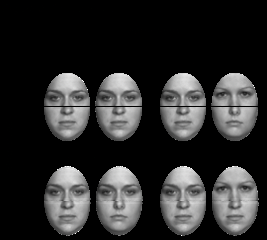
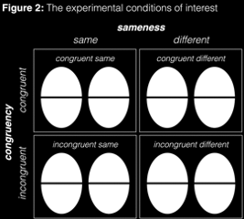
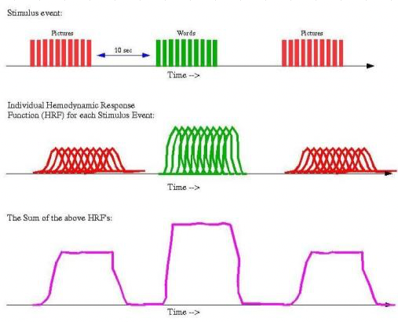
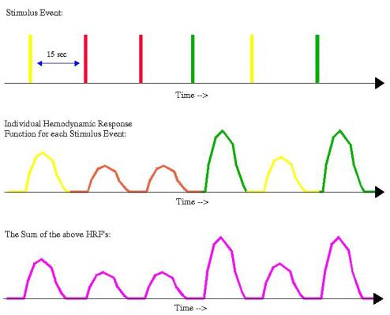
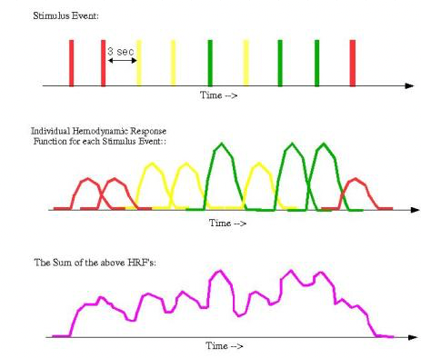
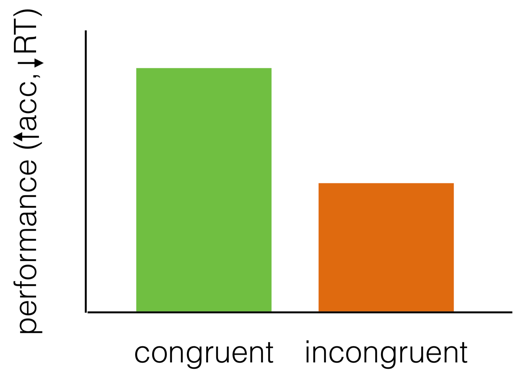
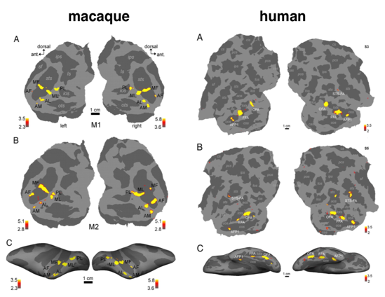
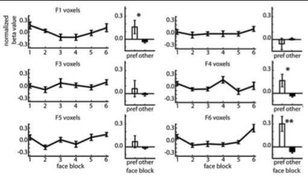

# High-Level Vision III: Faces (2021-09-28)

> Course: PSYCH-UH 2412 Cognitive Neuroscience | NYU Abu Dhabi | Authors: Sean Shan Guangji & Yumi Omori

---

[← Back to Main Contents](../README.md) | [← Previous Lecture](07-kanwisher-discussion.md) | [Next Lecture →](09-high-level-vision-IV.md)

---

## Composite Face Task

  

*Figure 1: The modified composite face task — two face halves presented sequentially, same (S) or different (D)?; bar chart showing better performance (face accuracy, ↓RT) in congruent vs. incongruent condition*

  

*Figure 2: The experimental conditions of interest — 2×2 grid: sameness (same/different) × congruency (congruent/incongruent), showing face pairs*

- The key manipulation is congruency.
  - People should be better in congruent than incongruent because faces are processed holistically.
  - In the incongruent cases, part of the faces is the same when you are supposed to say different, and vice versa.

---

## Block vs. Event-Related Design

- Sluggish nature of the HRF constraints our experimental design.
- **Block design**: the most statistically powerful and simple experimental designs, but have serious limitations from a psychological perspective (subjects will be habituated to stimuli, so definitely not for tests involving elements of surprise).
- **Slow event-related design**: less statically powerful, potentially more flexible, boring, and inefficient.
- **Rapid event-related design**: the good tradeoff between statistical power and psychological considerations. (More random order: the timing is mixed up because the sequence is not mixed up.)

  

*Three-column diagram — (Left) Block design: stimulus events, individual hemodynamic response function (HRF) per event, summed HRFs; (Center) Slow event-related design: stimulus events, individual HRF, sum; (Right) Rapid event-related design: stimulus events, individual HRF, sum*

---

## Beyond the FFA

- Multiple face-responsive areas in the ventral visual stream.
  - Occipital and temporal cortex.
- The organization seems relatively conserved across humans and macaques.

  

*Brain maps comparing macaque (left) and human (right) face-responsive areas — rows A, B, C showing ventral and lateral views with labeled face patches*

  

*Additional brain surface maps of face-responsive regions — macaque and human comparisons*

  

*Additional cortical map figures for face patches*

  

*Extended face patch comparison data*

  

*Face-selective region mapping supplemental figures*

  

*Supplemental brain maps — face module comparisons*

  

*Face processing areas data figure*

  

*Ventral visual stream face areas — additional map*

  

*Face patch organization figure*

---

## Detection or Recognition?

- Evidence for tuning for individual faces in humans which can be seen at the voxel level.

  

*Top row: Fixation, F1, F2, F3, F4, F5, F6 (individual face stimuli used in the experiment)*

  

*Grid of plots (F1 voxels, F3 voxels, F4 voxels, F5 voxels, F6 voxels) — normalized beta value across face blocks 1–6 (left panels) and bar charts comparing preferred vs. other face conditions (right panels), with significance markers (*)*

---

## Visual Agnosia

- **Apperceptive agnosia** is a failure in recognition due to deficits in the early stages of perceptual processing.
- **Associative agnosia** is a failure in recognition despite no deficit in perception.

- **Apperceptive agnosia** (Statistical perceptual agnosia):
  - Some low-level functions of sensation and feature identification were spared, as was, indeed, an abstract understanding of the visual properties of real-world objects.

- **Associative agnosia** (Associative agnosia):
  - "The purest form as a normal percept that has somehow been *stripped of meaning*."
    - Counterargument: the perception of many of these patients is unlikely to be truly normal.
    - For example, despite the high fidelity of the drawings, many patients producing copies of comparable quality have been described as doing so in a "slavish," "line-by-line" manner, and doing so "exceedingly slowly".

---

[← Back to Main Contents](../README.md) | [← Previous Lecture](07-kanwisher-discussion.md) | [Next Lecture →](09-high-level-vision-IV.md)