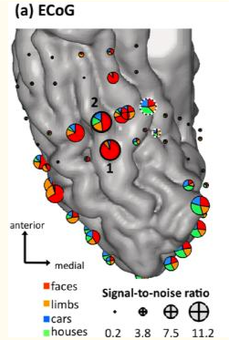
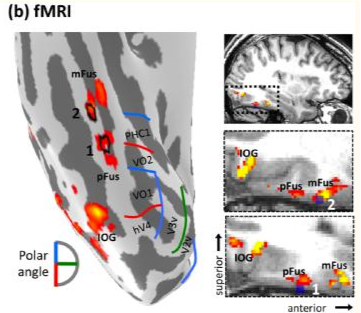
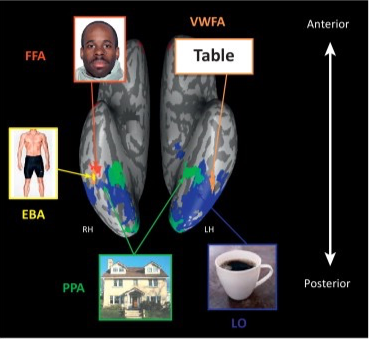
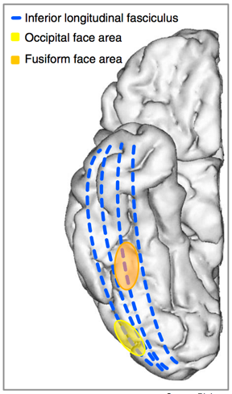
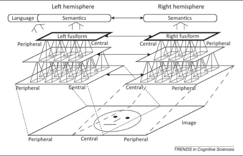

# High-Level Vision IV: Faces, Objects, and Modules Revisited (2021-09-30)

> Course: PSYCH-UH 2412 Cognitive Neuroscience | NYU Abu Dhabi | Authors: Sean Shan Guangji & Yumi Omori

---

[← Back to Main Contents](../README.md) | [← Previous Lecture](08-high-level-vision-III.md) | [Next Lecture →](../module3-attention-and-working-memory/10-attention-I.md)

---

## Prosopagnosia Revisited

  

*Brain diagram showing inferior longitudinal fasciculus (blue), occipital face area (orange), and fusiform face area (yellow)*

- Prosopagnosics display an inverted face inversion effect.
- What is the relationship between prosopagnosia and occipitotemporal face processing regions? (Is it the case that people with prosopagnosia have abnormal FFA?)
- Unfortunately, not very clear. However, it seems to be the case that people with developmental prosopagnosia might have reduced the density of the inferior longitudinal fasciculus.
- In general, prosopagnosia does not give much insight into the neural base of face processing.

---

## Causal Evidence

- People with epilepsy see flashes of light due to the abnormal activation of visual neurons.
- Researchers implement electrodes to stimulate the visual system.

  

*Left: (a) ECoG electrode placement on cortical surface (face-selective patches marked, signal-to-noise ratio shown); Center: (b) fMRI face-selective maps with polar angle; Right: Visual areas map (FFA, EBA, PPA, VWFA, LO) with face/body/place/word stimuli images*

- Take-aways:
  - The experimenters are lucky to have such an articulate patient with epilepsy.
  - The electrodes change visual perception in general. (See light flashes, metamorphosis of faces, objects, and words)
  - It does not seem to be the general extorsion of the visual field, but more of a specific one with certain consistencies (i.e., changes in shapes / stretches).
  - The patient claimed that the face changed into someone he has seen before. This involves recognition and memory.
  - The nature of the experiment, namely the "spontaneous report", is beneficial for drawing convincing conclusions.

---

## Beyond Face Modules: (see the figure above)

| Abbr. | Full Name | Location | Function |
|-------|-----------|----------|----------|
| FFA | Fusiform face area (Fusiform face area) | Inferior temporal cortex (IT), In the fusiform gyrus (Brodmann area 37) | Face recognition |
| EBA | Extrastriate body area (Extrastriate body area) | A subpart of the extrastriate visual cortex; Anterior to the primary visual cortex (area V1 / striate cortex) | Visual perception of body and body parts |
| PPA | Parahippocampal place area (Parahippocampal place area) | Sub-region of the parahippocampal cortex; Lie medially in the inferior temporo-occipital cortex | Encoding and recognition of environmental scenes |
| VWFA | Visual word form area (Visual word form area) | Left fusiform gyrus and surrounding cortex | Word recognition; May also process meaning |
| LO | Lateral occipital (Lateral occipital) | — | Visual object perception (In general) |

- Potential problems:
  - We can perceive infinite numbers of types of things. It is impossible to have infinite numbers of modules.
    - Counterargument to this counterargument: one does not need infinite numbers of modules. One just needs modules for the things that are really important.

---

## Grandmother Cells

  

*Row a (top): Many individual face stimuli with spike rate recordings; Row b (top right): histogram of spike counts per picture number showing selective high firing for ~picture 30 (Jennifer Aniston cell)*

  

*Row a (bottom): More individual face stimuli with corresponding recordings*

- Individual neurons in the human **medial temporal lobe** responded selectively (?) to images and names of individuals.
- Evidence of modules taken to an extreme? (A particular neuron for Jennifer Aniston—portrays, casts, names!)
- What is the function of these cells?
  - Perception? Medial temporal, not perceptual regions…
  - Recognition? Too slow for recognition… (A person could recognize the image before the cells started firing.)
  - New/old long-term memories? Possibly!

---

## Counterargument of "Grandmother Cell"

  

*Three images: grayscale face photo (left), face photo with white dot landmark markers (center), scatter plot of facial landmarks in PC space (right)*

- The transformation from landmark space into the face PC space effected a recoding from a human-defined code into a code that reflected the statistical distribution of the image properties of the set of 200 faces. Most of the dimensions in face PC space were "holistic," in that they captured change along a dimension that involved multiple parts of the face.
- Why are we going into this level of detail about this face PC space?
- The reason is that the visual system of the monkey seems to use this face PC code for the perceptual analysis of faces!
- Before too long scientists would identify which was the best axis for that neuron, and could then demonstrate (i.e., they could predict) that any face that fell along this axis in face PC space would optimally drive this neuron, and that any face that didn't fall along this axis would produce a weaker response, the amount of weakening based on the distance from the preferred axis.
- Furthermore, an implication of this model is that a single grandmother unit could not uniquely represent an individual face, because an infinite number of faces can be represented along any single axis in face PC space.

---

## A Non-Modular Account

- The pattern of activity across the **ventral temporal cortex** predicted the object category.

  

*Left panel: Four columns of object category images (faces, bodies, tools, etc.) in green/pink/blue/yellow frames; Right panel: Brain activation map labeled "Response to Faces" with Even Runs highlighted*

  

*Left: Bar graph showing within-category correlations (red) vs. between-category correlations (blue) across All object-selective cortex, Excluding maximally-responsive voxels; Right: images of face/body/tool stimulus categories*

When testing under the same object category, the experimenter did multiple runs.
There are high correlations between the odd and even runs of the same object category; however, it appears unrelated when subjects perceive across different object categories. (Red vs. Blue)
This means, brains are similar when responding to, for example, houses, but not any other thing else.

Under the same object category, experimenters found the most object-selective voxels (e.g., FFA for faces). Then, the experimenters virtually lesion the subject by removing the voxels. (Dark vs. Light)

- Critically, this was true even when the most modular voxels were removed from the analysis. (Prediction: 96% accuracy)
  - For example, for faces, even if you do not take account of the FFA, the pattern of activity across the whole ventral temporal surface was very similar to before.
  - The patterns of activity exist and remain similar even in voxels that are not highly selective for faces.
  - Thus, the processing is actually distributed across the cortex. (**Distributed processing**)

---

## Interim Summary: Modular vs. Distributed

- Strong empirical evidence for perceptual modules in IT, as well as for distributed processing.
- Evidence for distributed processing in part relies on logical arguments.

---

## A Reconciliation?

- How do we reconcile evidence for modules and evidence for distributed processing?
  - So-called 'modular' regions process many kinds of stimuli, even if they respond preferentially to one stimulus class.
  - "Modularity" arises due to **specific computations** that must be performed, rather than processing of specific types of information.

---

## Example(?): Faces vs. Words

- Claim: modularity arises due to specific computations that must be performed, rather than the processing of specific types of information.
- For faces and words:
  - Strong evidence for modular processing in both domains.
  - Similar computations?
  - Different evolutionary & developmental time courses.

  

*Left brain image showing VWFA (Visual Word Form Area) and Face area (FFA) locations with "Table" word and face stimuli; Right: diagram of left and right hemisphere connectivity — language/semantics connections, left fusiform/right fusiform areas, peripheral and central processing pathways*

- Lateralization of face processing develops relatively late, (~10 yo, maybe up to 30 yo?)
- Lateralization of word processing emerges ~10 yo.
- Reading competence correlated with face lateralization.
  - Face & word "modularity" emerges as a result of competition for processing resources.
- Theory: the module is about the type of computation that happens to be associated with certain object categories.

---

## A Model for Face Recognition: (Axes)

- Rather than being sensitive to individual faces, face-sensitive neurons in macaques are tuned to different face "axes".
  - From the monkeys' neural activity (of only 200 neurons), the experimenters could predict what faces the monkeys were looking at. The experimenters then built a model to deconstruct the faces.
  - Neurons could respond equally to two different faces as long as they had the same value from particular axes.
  - It showed that neurons are not tuned to specific facial identities, but to (multiple) axes that the faces sit along.

  

*Step 1: Recording responses to parameterized faces from macaque face patches; Step 2: Single cells tuned to single face axes, blind to changes orthogonal to the axis (3D cube diagram of face axis 1, 2, 3 with firing rate color map); Step 3: Axis model allows precise encoding and decoding of neural responses (encoder/decoder diagram with actual face and predicted face)*

  

*Pairs of faces differing along face axes — showing how neurons tuned to axes respond similarly to faces with same axis values*

  

*Actual face vs. Predicted face (all) — model reconstruction results*

- Any face can be described as a combination of values along these (~50) axes.

---

[← Back to Main Contents](../README.md) | [← Previous Lecture](08-high-level-vision-III.md) | [Next Lecture →](../module3-attention-and-working-memory/10-attention-I.md)