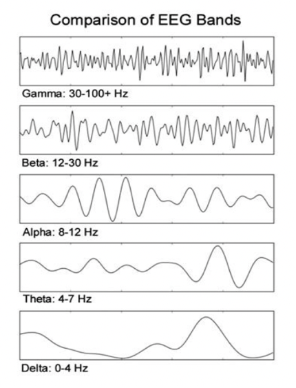
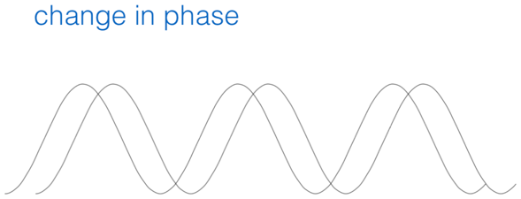
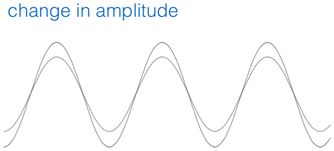
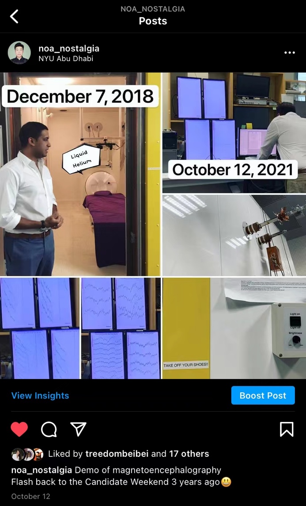

# Discussion of Worden et al.; M/EEG Demonstration (2021-10-12)

> Course: PSYCH-UH 2412 Cognitive Neuroscience | NYU Abu Dhabi | Authors: Sean Shan Guangji & Yumi Omori

---

[← Back to Main Contents](../README.md) | [← Previous Lecture](10-attention-I.md) | [Next Lecture →](12-attention-II-III.md)

---

## Paper 7: Anticipatory Biasing of Visuospatial Attention Indexed by Retinotopically Specific α-Band Electroencephalography Increases over Occipital Cortex

*(Original title in Chinese: 视觉空间的注意力的预期偏向由视网膜上特定的α波段脑电图指示，在枕叶皮层上增加)*

---

- Covert attention = Endogenous attention (directly willfully), nothing stimulus salient.
- Why? Process relevant from irrelevant.
- Indicate the orientation only at the attended side.

**Which part important?**

We mainly care about the delay part – alpha stimulus before the onset of stimulus (though there is also data in the delay before next trial).

  

*Experimental paradigm: Panel A shows Cue (35ms) → Delay (1000ms) → Stimulus (85ms) → Delay Before Next Trial (1500-3000ms). Cue Right (50%) leads to Left Stimulus (50%), and Cue Left (50%) leads to Right Stimulus (50%). Panel B shows the timing diagram with Cue, Orientation Stimulus OR Motion Stimulus, and a 1000ms delay interval.*

**Gating effect?** What gets in & What gets out (allow something to process more/less).

**Data: where do the alpha waves come from?**

It is not the brain activity; it is the amplitude of the alpha.

  

*ERP and Alpha TSE data: Panels B and D show left-hemisphere electrodes — ERP (top, μV scale 0–4) and Alpha TSE (bottom, μV scale 1.5–3.5) over 0–1200ms. Panel A (center) shows the electrode montage on a scalp diagram with two highlighted electrodes (blue circles). Panels C and E show right-hemisphere electrodes — ERP (top) and Alpha TSE (bottom). Legend: Cue Lower Left (green), Cue Lower Right (pink/red).*

  

*Additional ERP/alpha figures from Worden et al.*

  

*Additional ERP/alpha figures from Worden et al.*

  

*Additional ERP/alpha figures from Worden et al.*

  

*Additional ERP/alpha figures from Worden et al.*

---

## M/EEG Demonstration

  

*Social media post (WeChat): "I'm back! Last time it was fMRI, this time it's MEG. 'The art of magnetoencephalography'. Reminiscing about the candidate weekend from 3 years ago! Although you really can't see anything in real-time, I'm still very happy. Because there is liquid helium inside the MEG, it's extremely expensive…… therefore many universities only have EEG but not MEG. Once again I feel that having money is really good, and you need to stand up straight." — Photos showing the MEG machine at NYU Abu Dhabi on December 7, 2018 and October 12, 2021.*

  

*Instagram post (@noa_nostalgia, NYU Abu Dhabi): "Demo of magnetoencephalography. Flash back to the Candidate Weekend 3 years ago." — Photos of the MEG demonstration on October 12, 2021, showing the MEG machine and lab setup.*

---

[← Back to Main Contents](../README.md) | [← Previous Lecture](10-attention-I.md) | [Next Lecture →](12-attention-II-III.md)