# Attention II-III: Neural Models, Control of Attention; Eye Tracking (2021-10-14 & 2021-10-26)

> Course: PSYCH-UH 2412 Cognitive Neuroscience | NYU Abu Dhabi | Authors: Sean Shan Guangji & Yumi Omori

---

[← Back to Main Contents](../README.md) | [← Previous Lecture](11-worden-discussion.md) | [Next Lecture →](13-navalpakkam-discussion.md)

---

## What is the Unit of Selection?

- What aspect of attended information are we actually paying attention to?
- Any of them, depending on our goals!

**Location — Feature — Object**

  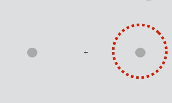

*Three columns illustrating units of selection: Location (brain with "right" thought bubble + spatial cueing display with dashed circle), Feature (brain with colored blob thought bubble + multi-colored shapes display), Object (brain with silhouette thought bubble + face-scene composite image)*

---

## Objects as the Unit of Selection

- A house and a face overlay with each other (50/50).

- Two stimulus types:
  - Houses moving, faces static.
  - Faces moving, houses static.
- Two attention conditions:
  - Attend to the motion. (moving)
  - Attend to the position. (static)
  - (The task was an attention-to-feature task. It was not attention-to-object because people can do the task by squinting.)
- Task: look for repeats of motion or position.

  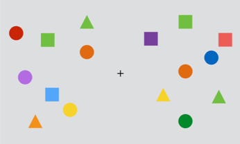

*Bar graph: BOLD response (relative to baseline) in FFA and PPA for face moving, face static, house moving, house static conditions; two bars per condition (purple = attend motion, teal = attend position)*

- Increase in BOLD signal in object-selective areas (FFA, PPA) when a feature of that object (motion, position) was attended. (despite that the faceness/houseness is not important for attention)
- Enhanced processing due to attention is spread [from the feature we are attention to] to other attributes of attended objects. (As for an object, when you pay attention to one feature, other parts come along for free.)

  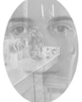

*Additional figures for objects-as-unit-of-selection experiment*

---

- Critique: we can definitely say there is enhanced processing, but such BOLD activity does not necessarily mean attention.
  - Theoretically, we do not like reverse-inferencing. We do not want to infer cognitive state from brain activities.
    - We do not want to say "oh their motion processing region was active, therefore they were processing motion".
      - But if studies do predictions beforehand, there is no such fallacy.
    - We want to go the other way: when asking them to do a motion task, the area MT was active. Maybe MT has to do with this.

---

## Interim Summary of Attention

- Attention can operate on different dimensions of our visual world: location, feature, object.
- Attention boosts behavioral performance: increases ACC, decreases RT, decreases threshold.
  - Equivalent to a brighter/more tilted stimulus.
- Attention can operate on different dimensions of our visual world: location, feature, object.
  - One possibility: by gating/selecting sensory processing (via alpha oscillations)
    - Enhancement or inhibition that is relative to the neural condition.
  - However, this is not the only way attention might operate!

- Where in the processing stream does attention affect behavior?
  (Is the selection happening early/late in the processing stream?)
  - On one hand, we saw that attention appears to gate perceptual processing (likely occipital).
    - The *cocktail party effect* is the phenomenon of the brain's ability to focus one's auditory attention on a particular stimulus while filtering out a range of other stimuli, such as when a partygoer can focus on a single conversation in a noisy room. 但这个filter不能说明是early (sensory/perceptual)还是late (decision-making)
  - On the other hand, we've all experienced **breakthrough effects** in a cocktail party context.
    - A was only paying attention to B, but suddenly C said A's name. Such a breakthrough effect provides evidence for selection happening late. Different sensory/perceptual information gets in, and then people make a decision.
  - fMRI would not be ideal to examine all these due to its poor temporal resolution.

---

## Neural Evidence for Early Selection

- Approach:
  - Measure neural response to faces using EEG.
  - Observe when this response is modulated by attention.

(Signal averaging; negative plotted upwards)

  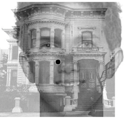

*N170 ERP waveform: a face photo on the left; scalp topography maps (Left, Right) showing distribution; ERP waveform on the right with amplitude (μV) from -7.5 to +2, time (ms) from -100 to 400, showing a negative peak at ~170ms. Caption: negative plotted upwards.*

- **N170**: at around 170 milliseconds after the presentation of a face, you see a negative bump.
  (N170 is modulated by faceness; a face that is either recognized or is not will stimulate N170.)
  (The argument is similar to FFA, but we are talking about a feature rather than a region.)

---

- Question: is this relatively early response modulated by attention to faces?
- Reasons for using composite images: to see what part of the signal in terms of the time gets modulated by attention. We see attention modulated N170 (and this is not the only modulation).

  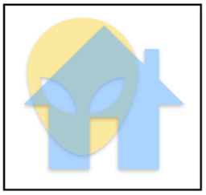

*ERP graph showing N170 and LN components: amplitude (microvolts, 4.0 to -4.0) vs. time (ms, 0–400); solid line = attend faces, dashed line = attend scenes; N170 and LN peaks circled in blue.*

- Face processing is modulated by attention at the early stages of sensation/perception.
- Evidence for early selection.
- This is also a paradigm of fixing the stimuli and changing the attention. The sensory inputs remain the same.

  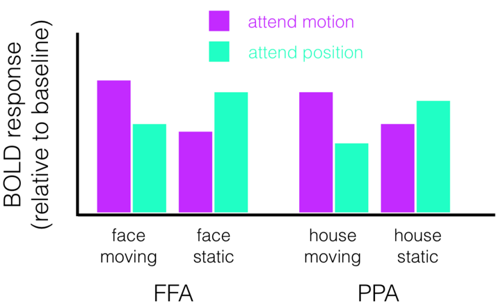

*Additional early selection/N170 figures*

---

## Part II

## The Oculomotor System

- A high degree of overlap between the system for controlling attention and the system for controlling eye movements.

  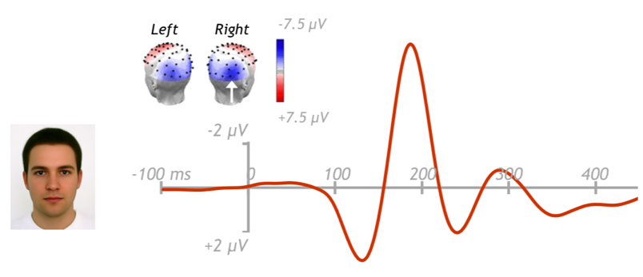

*Brain diagram of the oculomotor system: FEF (frontal eye fields), DLPFC, PEF, Caudate Nucleus, GP, SNr, SC, ON, Visual Cortex; arrows labeled Excitatory and Inhibitory showing connections; also shows Visual Input and Oculomotor Output pathways.*

---

## PD and the Oculomotor System

- PD: disrupted oculomotor function (slow saccades; more jumps rather than moving smoothly).
- Deep brain stimulation (DBS): by implanting and stimulating electrodes, the PD symptoms can be largely alleviated.

(Each line: the trajectory of eye movement)

---

## FEF and the Control of Attention

- Recorded from v4 neuron, stimulated FEF neuron with overlapping fields.
- Pairing up the v4 neurons and the FEF neurons:
  - When stimulating the FEF neuron, there will be an eye movement to a part of space.
  - Find the v4 and FEF neurons that are paired: visual receptor field of v4 & saccade field of FEF.
  - (There is nothing on the screen.)
- Recording activities for v4 neurons & Stimulating FEF neurons:
  - Again, stimulating FEF neuron, but to a much less degree which even does not stimulate the saccade. The eyes stay still despite these microstimulations because the microstimulations stayed subthreshold.
  - Red: microstimulate the FEF. Black: does not microstimulate the FEF. Look at the activity at v4: there are some spiking; but after the microstimulation, there is much more spiking.
  - Microstimulating the FEF neuron that would not cause an eye movement to that position is enough to enhance the activity in the v4 neuron that would like that part of space.
  - Microstimulation of FEF resulted in increased v4 firing – similar to endogenous attention (boosting processing). A plausible mechanism of how attention gets shifted.
  - This is evidence for early selection of attention because it occurs at the sensory-perceptual stage.

  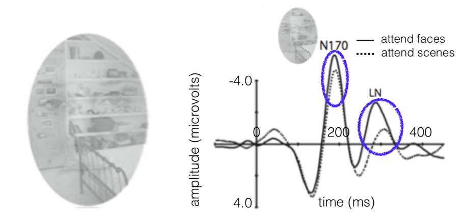

*Diagram (a): V4 recording electrode and FEF microstimulation electrode positioned in a monkey brain schematic. Panel (a) right: RF (receptive field) diagram with eye position traces (h, v) showing 2.0° scale bar, and Vis_in / Vis_out / FEF microstimulation traces. Panel (b): visual stimulus timeline, receptive field diagram, evoked saccades panel, 50 spikes/s scale, eye position trace, FEF microstimulation trace.*

  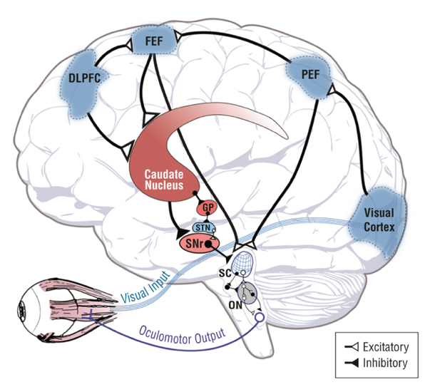

*Additional FEF/v4 microstimulation figures*

  

*Additional FEF/v4 microstimulation figures*

  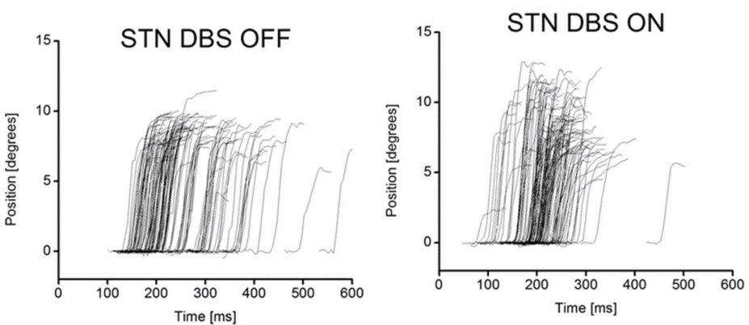

*Additional FEF/v4 microstimulation figures*

---

## Eye-tracking

- Monkeys: coil surgically implanted subconjunctivally结膜下 on the sclera巩膜.
- Humans: infrared camera. (Illuminate the eye, and software tracks the pupil position.)
- There needs to be a calibration process that fits the physical distance into the system.

  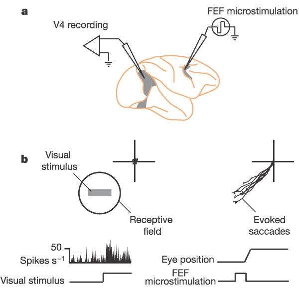

*Monkey eye-tracking: diagram showing Y-junction and coil fixture on sclera; X-ray/CT image of the implanted coil on the sclera surface.*

  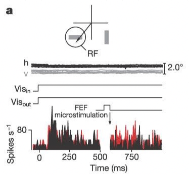

*Human eye-tracking setup: photo of participant sitting in front of monitor with eye-tracking camera; screenshots of camera setup software showing pupil tracking, crosshair calibration instructions ("Have the participant fixate the four corners of screen. Observe the eye window to ensure crosshairs present at all four corners"), and infrared eye image.*

  

*Additional eye-tracking figures*

  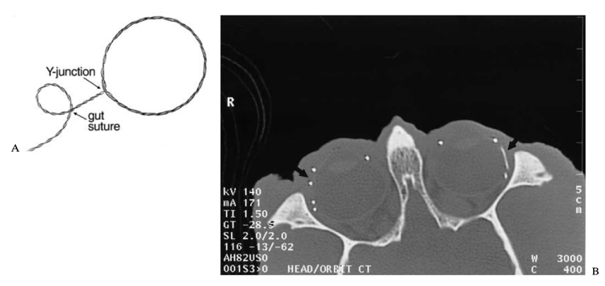

*Additional eye-tracking figures*

  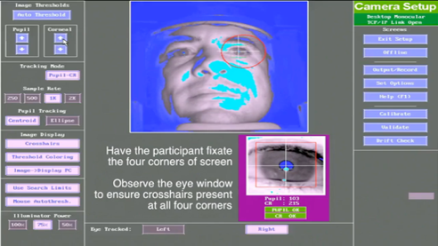

*Additional eye-tracking figures*

---

[← Back to Main Contents](../README.md) | [← Previous Lecture](11-worden-discussion.md) | [Next Lecture →](13-navalpakkam-discussion.md)