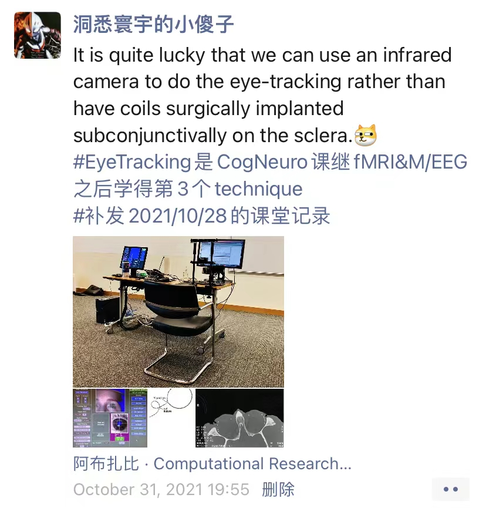
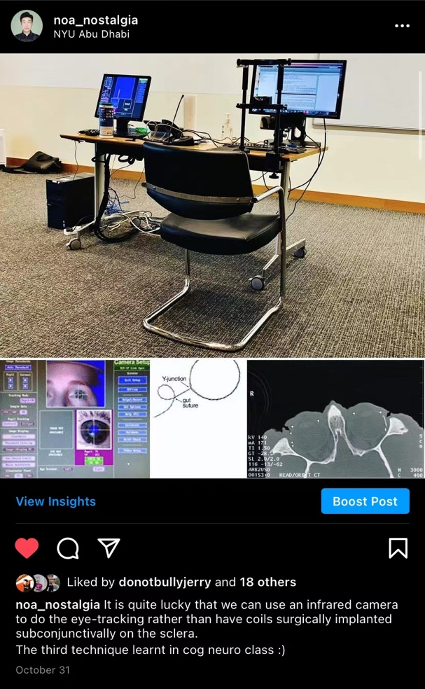
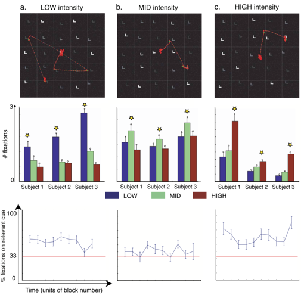

# Eye-Tracking Demonstration; Discussion of Navalpakkam & Itti (2021-10-28)

> Course: PSYCH-UH 2412 Cognitive Neuroscience | NYU Abu Dhabi | Authors: Sean Shan Guangji & Yumi Omori

---

[← Back to Main Contents](../README.md) | [← Previous Lecture](12-attention-II-III.md) | [Next Lecture →](14-working-memory-I.md)

---

## Eye-Tracking Demonstration

  

*Social media post (WeChat, "洞悉寰宇的小傻子" / "The Little Fool Who Sees Through the Universe"): "It is quite lucky that we can use an infrared camera to do the eye-tracking rather than have coils surgically implanted subconjunctivally on the sclera. #EyeTracking is the 3rd technique learned in CogNeuro class after fMRI & M/EEG. #Supplement for the October 28, 2021 class recording." — Photos of the eye-tracking setup at NYU Abu Dhabi on October 31, 2021.*

  

*Instagram post (@noa_nostalgia, NYU Abu Dhabi): "it is quite lucky that we can use an infrared camera to do the eye-tracking rather than have coils surgically implanted subconjunctivally on the sclera. The third technique learnt in cog neuro class :)" — Photos of the eye-tracking lab setup and infrared eye camera view.*

---

## Paper 8: Top-down attention selection is fine grained

*(Original title in Chinese: 自上而下的注意力选择是细化的)*

### Summary

- **Goal:** granularity of top-down attention signals
- top-down = endogenous attention
- bottom-up = exogenous attention
- Understanding granularity: 1. precision; 2. dimension / feature (in general or more precise)
- 25 Ls on the screen
- In each category within a dimension: 1. intensity (luminance), 2. size, 3. saturation
- Find & report numbers
- [Do calculations, different from using *catch trials*]
- Coarse guidance will be boosting all of the distributions equally
- Fine-grained guidance will be boosting one at a time.
- (Problem of **linear separability**: boost high or boost low)
- Measure the fixation and RT (but the RT is uninteresting to us)
- # fixations → top down
- (Number of fixations on the specific intensity that the target is going to be in)
- (Graph – bar: the number of fixations on that intensity)

  

*Figure from Navalpakkam & Itti (Journal of Vision, 2006): Panel (a) coarse top-down guidance — signal diagram showing LOW/MID/HIGH intensity nodes all receiving equal attention weights, three sample search displays (25 Ls), and bar graph of # fixations showing roughly equal bars for LOW, MID, HIGH. Panel (b) fine top-down guidance — signal diagram showing only MID intensity node receiving attention weight, three sample search displays, and bar graph of # fixations showing a tall green (MID) bar and short blue (LOW) and dark red (HIGH) bars.*

---

### Some critiques

- Doing the task for 3 days & only 200 trials in an hour is very slow;
- Did not mention counterbalancing the order; (think about: how could that potentially be a problem)
- Did not clearly mention the location of targets; (hope to be randomized)
- Did not elaborate on the **speed-accuracy trade-off** (speed ↑, accuracy ↓; speed ↓, accuracy ↑) → rule out possibilities of shifting strategy. In this type of task, we do not want people to shift strategy in the middle.
  (Only when speed and accuracy both improves are attention or WM, otherwise it is shifting strategy)

---

### Results

- Subject size (having 3 subjects) is not ideal.
  (Despite that it can generalize because it is a low-level processing which is not likely to be affected by population.)

  

*Results figure from Navalpakkam & Itti: Top row — three search display screenshots labeled (a) LOW intensity, (b) MID intensity, (c) HIGH intensity, with red fixation lines overlaid. Middle row — three grouped bar graphs (# fixations for Subject 1, Subject 2, Subject 3), with bars colored blue (LOW), green (MID), dark red (HIGH); asterisks mark significant differences. Bottom row — three line graphs showing % fixations on relevant cue (0–100%) vs. time (units of block number), one graph per intensity condition.*

- The graph in the middle is the most important: rule out the linear separability.

  

*Additional results figures from Navalpakkam & Itti*

  

*Additional results figures from Navalpakkam & Itti*

- Graphs in the last row: one additional feature – time. Pattern consistent overtime.
- Critique: in mid, there is a little bit more but not much more than 1/3.
- Parallel: search the whole field at once (RT does not change with # items).
- Serial: search one item at a time (the more item you add, the longer time it takes).
- Critique: shape is also different (as a confound).
- Better way: e.g., when we are examining the intensity dimension and looking at the mid, we can also have different shapes in low and high.

---

[← Back to Main Contents](../README.md) | [← Previous Lecture](12-attention-II-III.md) | [Next Lecture →](14-working-memory-I.md)