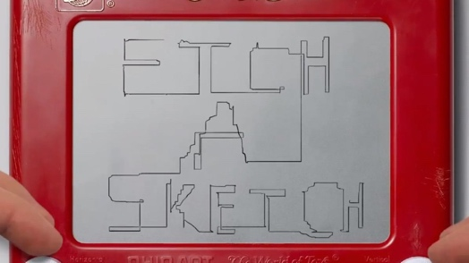
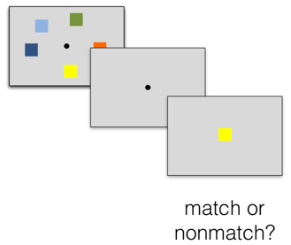
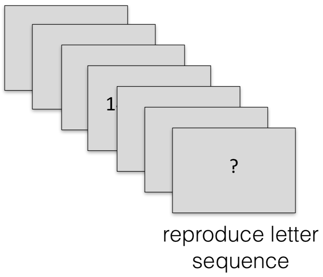
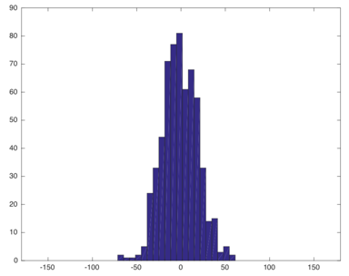
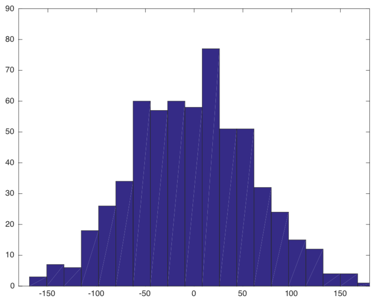
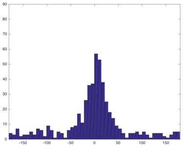
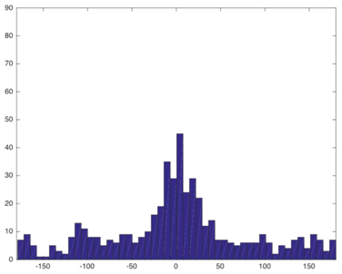
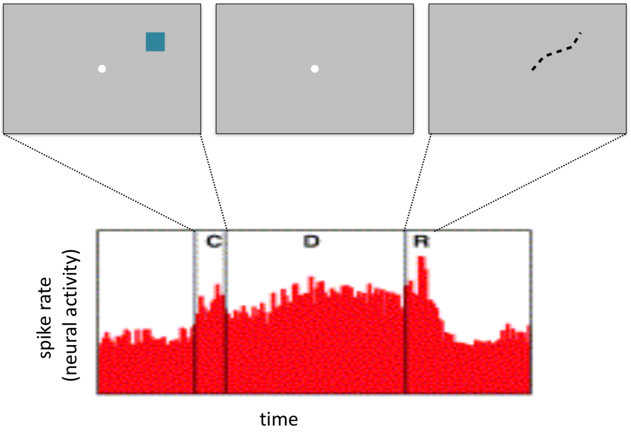
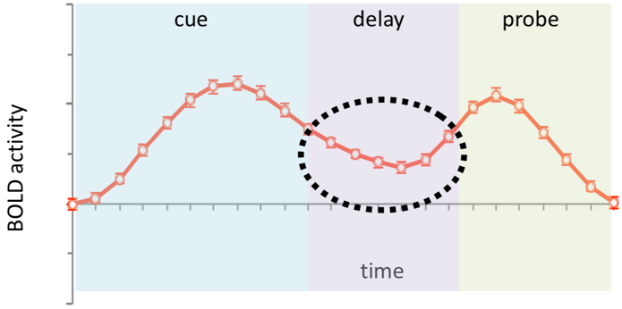
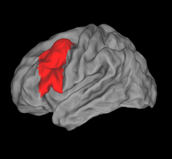

# Working Memory I: Cognitive Models (2021-10-26 & 2021-11-02)

> Course: PSYCH-UH 2412 Cognitive Neuroscience | NYU Abu Dhabi | Authors: Sean Shan Guangji & Yumi Omori

---

[← Back to Main Contents](../README.md) | [← Previous Lecture](13-navalpakkam-discussion.md) | [Next Lecture →](15-working-memory-II.md)

---

## Working Memory (WM)

- **The ability to actively represent information over brief intervals when it is no longer available in our environment.**
  - It is a core cognitive function that facilitates our reasons, plans, communications, etc.
- Analogy: *etch sketch board*: fragile, limited to capacity and resolution.

  

*An etch-a-sketch board used as an analogy for working memory — fragile, limited in capacity and resolution*

- **Actively represent:**
  - Active: repeated rehearsal.
  - Active vs. passive representation is related to the distinction of WM vs. LTM (long-term memory).
- **Information: (format)**
  - Basically, everything we perceive can have a WM, e.g., vision, smell, taste, emotion, intuition, etc.
- **Brief intervals: (temporal scales)**
  - Decay over seconds.
  - Some memories transform into LTM; there is no clear distinction regarding the time frames between WM and LTM (seconds vs. hours/days).

---

## Why Studying WM

- **Basic science:**
  - WM is a core cognitive function.
  - WM might serve as a model system to generalize understandings on higher-order cognition.
- **Clinical relevance:**
  - Cognitive deficits, such as impairments in WM, are found in schizophrenia, depression, ADHD, aging, traumatic brain injury, multiple sclerosis, stroke, etc.
- **Sociological relevance:**
  - WM ability is related to socioeconomic status (SES), scholastic outcomes, etc.
    - Brain training at its core is WM training.

---

## Key Questions in WM

- **Behavioral:**
  - How much stuff can we hold in WM? Why is this important? (capacity)
  - What is the format of the things we hold in WM?
  - Are all things in WM equal?
- **Neural:**
  - How does information persist over time?
  - What are the neural computations that allow for active storage?

---

## Some Questions That Were Raised in Class

- **What are the differences between working memory and short-term memory?**
  - Some people make important distinctions; the professor tends not to.
  - People who make distinctions think that working memory involves extra processes on top of the working memory.
    - Short-term memory: retaining information (more passive).
    - Working memories: manipulating information (more active).
- **Can I say the hippocampus played a role in LTM but not short-term/working memory?**
  - Yes. Medial temporal lobe (MTL) structures, including the hippocampus, are critical for LTM, and certainly not so important for short-term/working memory.
  - However, the truth is somewhere in the middle.
    - There is evidence that people with MTL damage have subtle but significant WM deficits.
    - Humans with electrodes implanted due to epilepsy have MTL neurons active during WM tasks.
    - Therefore, the hippocampus is involved in WM to some degree.
      - An interesting question would be under what circumstances and what is its role.
  - The neural basis of long-term vs. short-term/working memory is distinct in terms of individual neurons, but the distinctions are not clear in terms of the regions.

---

## What Is the Capacity of WM?

- **Span tasks: (simple vs. complex span)**

  

*Diagram illustrating simple span task: sample (500 ms) → delay (2000 ms) → probe (500 ms) → match or nonmatch response; vs. complex span: a series of stimuli culminating in a reproduce-letter-sequence response*

- **Simple span:**
  - Participants get a sample on the screen which has different shapes, then the sample disappears and there is a two-second delay. After that, there is a probe shown on the screen and the participants have to indicate whether something has changed. (Match vs. non-match)
    - Easier to analyze.
    - Can modify to learn about how items are stored in WM.
      - The *phonological loop* is a hypothesized mechanism for acoustically coding information in WM.
      - The letters were presented visually, but the pattern of recall errors indicated that perhaps the letters were not coded visually. The participants were apparently using an acoustic code because during recall they were more likely to replace a presented letter with an erroneous letter having a similar sound (e.g., T for G) rather than one with a similar shape (e.g., Q for G).
      - This was the first insight suggesting that an acoustic code might play a part in the rehearsal.
- **Complex span:**
  - Participants need to see a series of equations and determine their correctness, and their job is to memorize the letter which appears between the equations in order. (A typical span is between 4–7.)
    - Higher ecological validity (closer to real-life), i.e., closer relationship to IQ, SES, and dopamine status.

---

## Span and Dopamine

- **Domaine (DA): important neurotransmitter.**
  - Implicated in rewarding; learning.
  - DA dysfunction in SZ (schizophrenia), PD (Parkinson's disease), and addiction.
- **Inverted U: the goldilocks effect.**
  - Either too little or too much dopamine leads to low cognitive ability; there is an optimum (in the middle).
  - It turns out that the phenomenon above relates to WM span/capacity.

(PET: see the amount of binding on the basal ganglia.)

  

*PET brain scans comparing High Span vs. Low Span individuals, showing greater dopamine binding (brighter signal) in the basal ganglia of high-span individuals*

  - We can give people dopamine, and if we do that, we can push people along this curve.
    - When you give dopamine to people with low/high WM span, their WM span is improved/worsened.
    - The effects of dopamine-manipulating drugs are different depending on where they are, to begin with.
      - There are certain genes that depend on where people fall on the curve. You can genotype people.
      - There is a relationship between where the females fall on the curve and their menstrual cycle. (Estrogen has interesting effects on the morphology of neurons.)

---

## Simple Span Revisited

- What is the limitation of span tasks in measuring the amount of information that can be held in WM?
  - Binary response!
- Simple span tests can tell us about how WM is organized when modifying into a color wheel.

- Instead of a binary answer, we get a continuous measure of WM precision. (Measure the angular difference.)
  - Confounds: perception differences, vision, motor difficulties, etc.
  - It is better to set a baseline for individuals by doing a trial without the delay.

(The better the performance, the narrower the distribution.)

---

## Resource Model and Slots Model

- **Resource model.** (The continuous version of a resource model)

  

*Resource model illustration: a water bucket (total resource) being divided among multiple cups (items), with histograms showing a single narrow peak at 1 item and a broader distribution at 3 items, reflecting continuous degradation of WM precision as more items are stored*

- **Slots model.** (The discrete version of a resource model)

  

*Slots model illustration: ice-cube tray (discrete slots) with a fixed number of cubes/slots, and histograms showing a bimodal distribution at higher loads — one sharp peak (item held in a slot) and a flat component (items not held in any slot)*

---

## How Do We Study the WM and the Brain?

- **Delay tasks:**
  - Segregate encoding, maintenance, response.

  

*Diagram of a delay task: three boxes labeled "cue" (encode), "delay" (maintain), and "probe" (retrieve/execute a response). The delay phase is highlighted. (Most research focuses on maintenance.)*

  (Most research focuses on maintenance.)
  - Delay tasks allow us to isolate neural activity associated with these subcomponents of WM.
- **Delay period activity:**
  - Neural activity that persists during the delay of a WM delay task.
  - The oculomotor delayed response (ODR) task:

(Focus on the principal sulcus; dorsolateral prefrontal cortex)
    - Neuron fires at some baseline level of activity.
    - Firing remains elevated above baseline throughout the entire delay.
    - Neuron fires during response and returns to pre-trial baseline levels.

  

*ODR task trial diagram showing three frames (stimulus on, delay, response saccade) linked to a spike-rate histogram showing elevated "C → D → R" activity, where D (delay) maintains firing above baseline*

---

## Observed in the Human Prefrontal Cortex with fMRI

- Observed in the human prefrontal cortex with fMRI.
  - Critique: the delay is not necessary maintenance of WM because it is contaminated by other factors. (Elaborated in the next lecture)

  

*BOLD fMRI signal over time during cue, delay, and probe phases, showing sustained activity during the delay period, with a brain diagram highlighting the prefrontal cortex region (area shown in red)*

[Roster plot: rows – trials; ticks – action potential of neurons.]

---

## The Principal Sulcus (9/46)

  

*Three images of the principal sulcus: (a) photograph of a rhesus monkey (Macaca mulatta) brain showing the arcuate sulcus and principal sulcus labeled, with 1 cm scale bar; (b) schematic cross-section of the prefrontal cortex showing Brodmann areas (8B, 9, 46, 1F, 8A, 45, 12); (c) color-coded map of prefrontal areas (8B, 9/46d, 9/46v, 8Ad, 8Av, 45A, 45B, 47/12, 44)*

---

## Coding

### Labeled Line Theory

> A group of neurons that performs one general function is called a dedicated line, often associated with a particular sensory modality. [Translation of: 一组完成一种一般功能的神经元称为专用线路，往往是一种特殊的感觉方式。]

| | |
|---|---|
| **Premises:** | Individual receptors preferentially transduce information about an adequate stimulus. |
| | Individu1al primary afferent fibers carry information from a single type of receptor. |
| **Conclusions:** | Pathways carrying sensory information centrally are therefore also specific, forming a "labeled line" regarding a particular stimulus. |
| | The brain associates a specific modality (the adequate stimulus) with a signal coming from a specific receptor. |
| | e.g. "light" is detected by the photoreceptors, even if the stimulus is pressure on the eye. |
| | In the cortex, perception is localized by modality, resulting in specific cortical areas for each sensation. |
| **Evidence:** | Within each sensory area, sensations are "mapped" in ways that maintain an orderly representation of the stimulus. |
| | e.g. the homunculus that is maintained within the somatosensory cortex; tonotopic maps that are formed in the auditory system; topographic maps in the visual cortex. |

### Pattern Theory / Population Code

> Coding by the number of nerve fibers participating in the response. [Translation of: 以参与反应的神经纤维数目编码。]

| | |
|---|---|
| **Premises:** | Some sensory systems (esp. taste and olfaction) integrate information across multiple primary afferents. |
| | A few types of afferent endings are multimodal (more than one sensation can be evoked by their activation). |
| **Conclusions:** | An ascending pathway can convey sensory information by altering the temporal pattern of action potentials among multiple responding primary afferents. |
| | Under this theory, it is the pattern of activation of neural networks that forms the basis of perception. |
| **Evidence:** | Examples are found in the olfactory system, and in color perception. |

  

*Diagram of population/pattern coding: left shows "Coding by Across Neuron Response Patterns" with multiple neurons (circles with varying fill), center shows a matrix of odorant receptors (A–H) responding to 14 different odorants with descriptions (rancid, sweet, sour, etc.), right shows labeled-line vs. pattern-code comparison diagrams for "Sweet" taste input through CNS*

#### My Summary & Understanding

- Labeled line coding and population coding are two main coding theories in neuroscience. Labeled line coding refers to that a specific neuron responds to one specific numerosity, while population coding refers to that a stimulus is represented by the joint activities of a number of neurons.
- Basically, the photoreceptors, taste receptors, and neurons in the somatosensory cortex follow the labeled line coding, whereas the olfactory receptors follow the population coding.
- In the labeled line coding theory, the upper bound of the things that could be represented equals the numbers of labeled lines that a person has. Differently, in the population coding theory, the representations could be way more than the numbers of neurons, which is an advantage.
- Another advantage of population coding is its robustness for distinction even when noises are present. Contrary to the labeled line coding theory, the fact that a neuron is firing does not uniquely tell people which stimulus the body is responding to. In other words, population coding has a huge redundancy in its firing pattern. Even when a neuron that is supposed to fire does not fire or a neuron that is not supposed to fire fires, the pattern is still distinctive.

  

*Additional coding theory figures*

---

## Sparse Coding

> Sparse coding refers to a representational format where only a small fraction of neurons are active at any given time. It is a form of population code, but with a small fraction of neurons active at any given time.

- This is a compromise between the labeled line and population coding.
- **Grandmother cell hypothesis**: a single neuron that fires to one's own grandmother exclusively.
  - This is like an extreme of the labeled line coding.
- **Actual finding**: Jennifer Aniston neuron.
  - A neuron fires to a specific, familiar person (Jennifer Aniston).
  - Invariant representation (multiple views of the same person; even when blindfolded and hearing voice only).
  - Sparse: only a few stimuli drive this neuron; selective: they prefer certain stimuli but also respond to others.
  - Similar to the labeled line, but not exactly like the grandmother cell (sparse, not exclusive).

  

*Jennifer Aniston neuron data: raster plots and peristimulus time histograms showing the neuron's selective response to Jennifer Aniston images/stimuli vs. other faces/stimuli*

---

## Multivariate Pattern Analysis (MVPA)

- Also known as pattern analysis or decoding.
- Conventional univariate approach: take the average response of all the voxels in a region.
- **Pattern analysis**: look at patterns of activity (responses across voxels) & use classification algorithms to predict what a participant is looking at.
  - Works like reading the brain's code.

  

*MVPA diagram: on the left, a row of voxels each showing a response time course (blue/orange curves); in the middle, a response pattern matrix; on the right, a classifier (with training data and test data phases) outputting predicted category labels*

- Applied to WM: can we decode what is being held in WM?
  - Classic approach for studying WM: find brain regions showing sustained delay-period activity.
  - MVPA approach: find brain regions whose patterns of activity carry information about what is held in WM.
    - The classic & MVPA approaches are complementary to each other.
    - Specifically, the MVPA approach is particularly sensitive for detecting information encoded in activity patterns, while the classic approach is sensitive to sustained, elevated mean activity.
    - Interestingly, researchers have found cases where the MVPA approach reveals WM content in brain areas that do not show elevated mean activity.
      - This implies that information can be encoded in other neural signals beyond sustained firing rate increase.

---

[← Back to Main Contents](../README.md) | [← Previous Lecture](13-navalpakkam-discussion.md) | [Next Lecture →](15-working-memory-II.md)