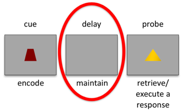
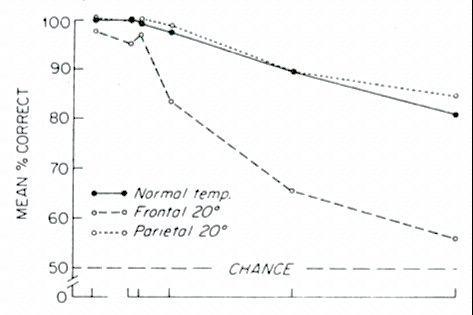
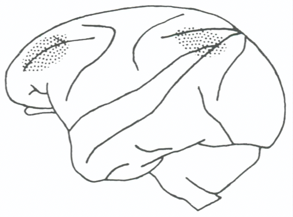
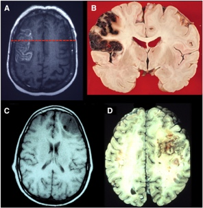

# Working Memory II: Canonical Neural Models (2021-11-04)

> Course: PSYCH-UH 2412 Cognitive Neuroscience | NYU Abu Dhabi | Authors: Sean Shan Guangji & Yumi Omori

---

[← Back to Main Contents](../README.md) | [← Previous Lecture](14-working-memory-I.md) | [Next Lecture →](16-single-unit-recording.md)

---

## WM Maintenance & the Brain: (Delay Period Activity & DLPFC)

- **Delay task:** segregate the encoding, maintenance, and retrieval period.
  - Different versions of the test (change the response): delayed response, delayed recognition, delayed oculomotor, delayed match to sample, delayed nonmatch to sample…

  

*Diagram of a delay task with three labeled stages: cue (encode), delay (maintain), probe (retrieve/execute a response). The delay/maintain phase is circled in red.*

**What is the neural activity in the brain that corresponds to the delay interval of the task?**

- ODR test: Firing remains elevated above baseline throughout the entire delay. (Mentioned in the last lecture)
- **Neural activity (in DLPFC) during the delay is thought to be the biological basis of WM. When combined with evidence that patients with DLPFC lesions have WM deficits, a theory claims that DLPFC stores information during WM.**

---

## Issues with Lesions and WM?

- The effects of lesions are not limited to the delay period!

  

*Brain scan images (MRI/PET) showing DLPFC lesion examples across multiple slices, illustrating the extent and location of lesion damage in patients with WM impairments*

  - Does the patient understand the task?
  - Can they perceive the stimuli?
  - Can they execute a response?
- How do we solve this issue?
  - **Method 1: remove the delay period. (incorrect)**
    - It does not rule out the many confounds: the fact that one can see it does not mean the person can encode it into the memory, remember it, keep it over the delay, or execute the response.
  - **Method 2: change more numbers of items. (incorrect)**
    - Changing of numbers of items changes the encoding demand. More stuff is put into memory and to retain in the memory. (Matters when: the person's attention is impaired → impaired encoding but not maintenance)
    - Expected results: all patients will do okay when there are fewer items, but the performance of the patients with the damage will drop off much more profoundly as there are more items.
  - **Method 3: increase delay period. (correct)**
    - The experiment controls everything except the time that a person has to hold something in the WM. The longer the time, the greater the demand.
    - Method: cool the brain tissue to impair the function.
      - The lesion is reversible: when heating the brain, the neurons will be active again. Thus, experimenters can use these animals as their own controls repeatedly and individual differences are eliminated.
    - Result: under normal temperature and parietal cooling, the performance did fall off when delays were longer, but the monkeys never fell under 80% accuracy. However, when DLPFC is cooled, the performance dropped almost to guessing. (This situation has the same concept as the expected results above.)

  

*Graph of mean % correct vs. delay duration comparing Normal temp, Frontal 20°C cooling, and Parietal 20°C cooling conditions, with a dashed line at chance level. Frontal cooling drops performance dramatically near chance level. Adjacent diagram of a monkey brain with cooling probe placement.*

---

## Alternative Theories of DLPFC & WM

- **What are the potential alternative explanations for DLPFC delay activity and WM impairments in DLPFC lesion patients?**
- **What are the WM-related processes happening during WM delays?**
  - **Storage of WM item information.**
  - **Storage of task rules, e.g., response mapping.**
    - Solution: teach participants the rules several days earlier and thus make sure they are in the LTM.
      - Counterargument: (Maintenance is "storage plus".)
        WM is LTM actively represented. Even though the rules are encoded in the LTM, they still have to be retrieved and maintained in the task. In this regard, it is almost impossible to differentiate the storage/maintenance of the item information and the task rules.
  - **Resisting distraction / Attention.**
    - A famous old experiment which is related:
      - Monkeys with prefrontal lesions are impaired with delayed tasks except when you turned the lights off.
      - Only when lights were off, there were no visual inputs to distract the monkeys and interfere with the task.
      - It was not they the monkeys could not remember the item information or the task rules; it was that they could not keep what they remembered in the phase of other stuff being processed by the brain.
  - **Rehearsal.** (But some people argue that it is pretty similar to storage.)
- Are there any other regions that exhibit delay activity?
  - If any other regions are carrying out the same function, we can question why the brain needs both regions.

---

## Delay Activity in IT Modules

- Procedure: instruction → encoding (one/two image/face) → 12-sec delay (because it is an fMRI test) → match response → a long inter-trial interval (allow the neuron activities to return to the baseline).

  

*Experimental paradigm diagram showing instruction phase (1 sec), encoding phase (3 × 1 sec), delay phase (12 sec), match/response phase (2 sec), and ITI (14 sec) for four conditions: 2-Scene, 1-Scene, 2-Face, 1-Face. YES/NO responses shown at the match phase.*

- During the cue period, there were no huge differences between the FFA and PPA depending on the type of the task. (The FFA/PPA was a bit more active in trials with faces/scenes because there were things supposed to be remembered.)
- **If these regions were just perceiving information, the performance should go back to zero in the delay period. However, here, during the memory delay, FFA continues to be active during face WM but not scene WM, and vice versa for PPA.**

  

*Bar graphs showing parameter estimates for FFA and PPA during the Cue Period and Delay Period, comparing Face WM (green) vs. Scene WM (blue). During the delay period, FFA is elevated for Face WM but not Scene WM, and PPA is elevated for Scene WM but not Face WM.*

  

*Brain images (MRI) showing the location of FFA (fusiform face area) and PPA (parahippocampal place area) within the ventral visual stream*

- It is a within subject design. As long as the differences are consistent across subjects, the results are significant despite having huge error bars.

---

## Why Is This Model Better Than the DLPFC Model?

- If all the information is stored in only one region (DLPFC), there will be competition between different kinds of information (e.g., faces vs. scenes). As for the FFA/PPA model, there is a compartmentalization of function.
- Occam's Razor: WM can be virtually everything; if there is a region (DLPFC) that is supposed to store the WM information, it too has to be able to represent virtually everything that a person can perceive; if so, it seems redundant and unnecessary – why not taking the advantage of the "machinery" in the brain that one already has?
  - Generally speaking, the brain's design is to take the shortest way possible to carry/process information.

---

## Problems with the "IT Module" Model

  

*fMRI images showing BOLD activity in visual regions during WM delay, illustrating that the IT module approach has limitations*

- With virtual lesions, people can still represent items in WM. But it does not mean to be localized in order to be stored in the visual regions.
- The model still does not rule out the confound of attention.
  - But one counterargument is that WM is attention extended over time.
- The regions are dedicated to so many things, so there are very likely to be interferences. How do the brain regions allocate resources between maintenance and perception?
- Most fundamentally, none of these is evidence for storage itself. They just show that the brain areas are active but nothing about necessity.

---

[← Back to Main Contents](../README.md) | [← Previous Lecture](14-working-memory-I.md) | [Next Lecture →](16-single-unit-recording.md)