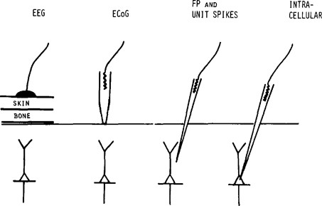
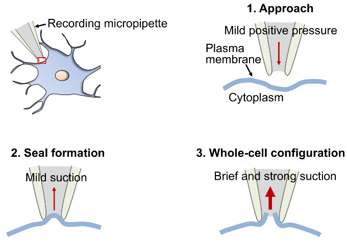
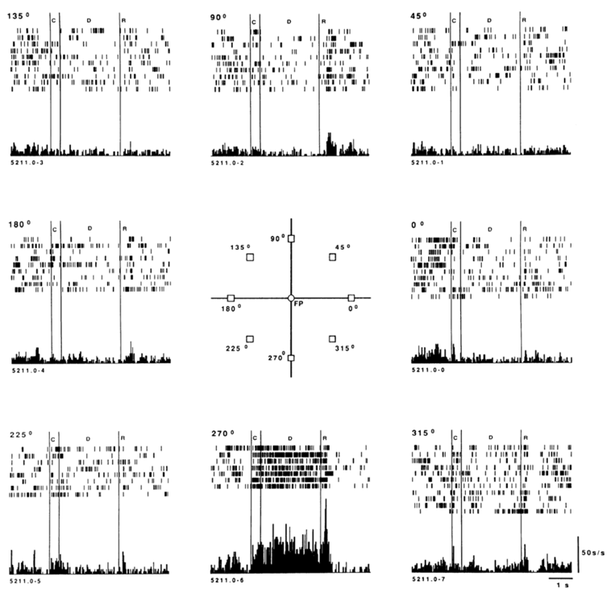
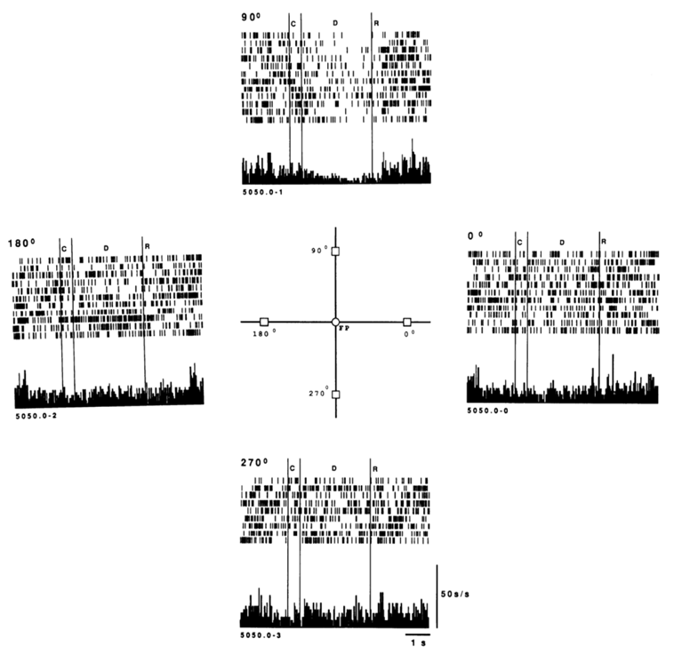
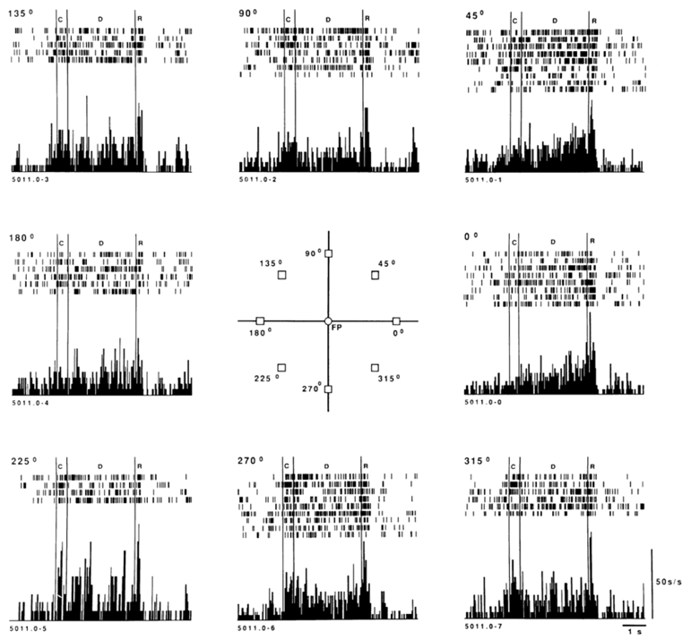
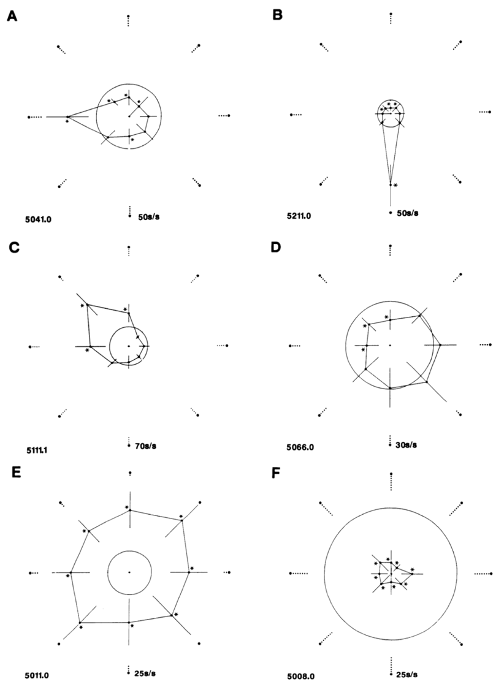
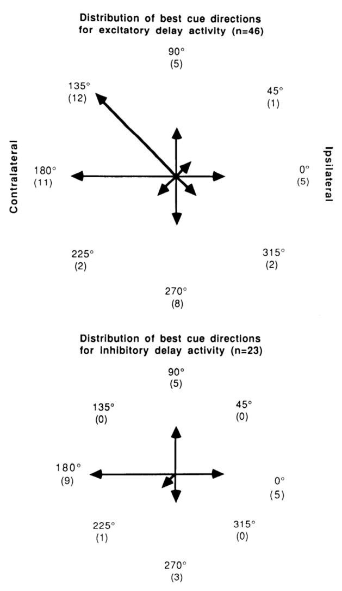
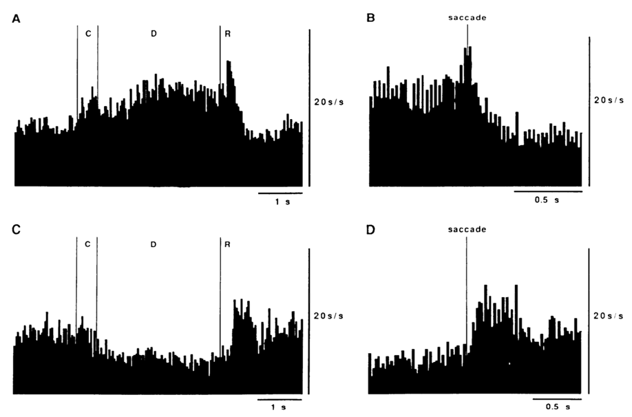

# Discussion of Funahashi et al. (2021-11-11 & 2021-11-16)

> Course: PSYCH-UH 2412 Cognitive Neuroscience | NYU Abu Dhabi | Authors: Sean Shan Guangji & Yumi Omori

---

[← Back to Main Contents](../README.md) | [← Previous Lecture](16-single-unit-recording.md) | [Next Lecture →](18-working-memory-III.md)

---

> **Paper 9:** Mnemonic Coding of Visual Space in the Monkey's Dorsolateral Prefrontal Cortex
> *(논文9：猴子的背外侧前额叶皮层的视觉空间的记忆编码 — Mnemonic Coding of Visual Space in the Monkey's Dorsolateral Prefrontal Cortex)*

---

## Overall Design & Aim

**Aim:** The article addresses that the neuron activity is the storage. (The neuron activity in DLPFC is not necessary the storage.) The article made a strong claim that the storage occurs in this brain region (DLPFC) and is in labeled line coding.

**Question:** Why does the paper emphasize the direction?
The direction brings about the **specificity** of each neuron and thus gives rise to the construction of the **memory map**. There is **ecological validity** because there are both the "where" and "how" regarding each neuron.

**General critique:** The delivery is not straightforward; the content does not always relate back to its purpose; and people could get lost.

---

## Method

### Oculomotor Delayed-Response Task (眼球运动延迟反应任务)

The top figure depicts the timing of presentation of the fixation target, peripheral cues, and reward.
The bottom figure illustrates the records of horizontal and vertical eye movements and single-neuron activity on a typical trial of the oculomotor
delated-response task.

  

*Figure A: Oculomotor delayed-response task timeline diagram showing ITI, F (fixation target), C (peripheral cue), D (delay), and R (reward) events for fixation target, peripheral cue, and reward traces. Figure B: An example of an oculomotor delayed-response trial showing horizontal gaze coordinate, vertical gaze coordinate, and neuron activity traces across ITI, F, C, D, and R epochs (1 sec scale bar, 10° scale bar).*

**Question:** Why are there certain degrees of firing during the ITI (internal interval)?
The neuron activity could result from eye movement, or this neuron is inhibited by fixation. There is no definite answer, and it is not important. The important part is that the neuron activity remained elevated during the delay period.

---

## Results

### Task Performance (任务表现)

Although the distribution of saccade endpoints is wider in the delay task than in the visually guided saccade task, nearly all saccades end near the appropriate location, even with 6-s delays. *(Also mentioned in Effects of Different Delay Durations)*

  

*Three scatter plots of saccade endpoints: (A) Visually guided saccade, (B) 3.0 s delay, (C) 6.0 s delay. Each plot shows a 20° × 20° grid with clusters of endpoints near the target locations. The distribution widens with longer delays but endpoints remain clustered near correct positions.*

**Critique:** The graphs did not indicate the accuracy (could be either 100% or 0% correct). The graphs are just distributions of eye positions.
**Critique:** The measurements are not ideal. They could record many quantitative data from the coordinates, but they just turned the result into qualitative. *(Here and also after, noted as "losing data".)*

---

### Neural Data Base (神经数据库)

| | |
|---|---|
| **Total sample** | 288 PS neurons |
| **Had task-related activity** | 170 (59%) | 118 (41%) |
| **Had significant delay period activity** | 87 (51%) of task-related [= 30% of total sample] | 83 (49%) of task-related |

Of the 87 neurons with significant delay period activity:

| Type | Count (%) | Description |
|---|---|---|
| DPA was the only TRA | 33 (38%) | Delay period activity was the only task-related activity |
| Had significant activity in segments immediately preceding or following the delay | 54 (62%) [most neurons] | |
| — Delay & Cue | 11 (13%) | |
| — Delay & Response | 32 (36%) | |
| — Delay & Cue & Response | 11 (13%) | |
| Had significant activity only in the cue period | 12 | |
| Had significant activity only in the response period | 55 | |
| Had significant activity in both cue & response | 10 | |
| Had significant activity at reward representation | 12 | |

**Critique:** Normally, the experimental paradigm is use one monkey and replicates on the other monkey. The paper used 3 monkeys, but it did not specify the differences between the 3 monkeys. Therefore, the extent to which the result is generalizable is questionable.
**Critique:** Many parts are just only descriptive. It is questionable whether researchers could use the descriptive data to formulate valuable results. *(Here and also after, noted as "only descriptive".)*

---

### Directional Specificity of Delayed Neuron Activity (延迟期活动的方向特异性)

Of the 87 PS neurons with the delay period, 69 (79%) were directional, i.e., a statistically significant difference in a delay period discharge rates across different cue locations, and the remaining 18 (21%) were classified as omnidirectional because they responded similarly during the delay period regardless of the cue locations.

The row of the raster: each trial.
Histogram: directional excitatory activity → storage.

  

*Raster plots and histograms showing directional activity in a PS neuron tested with eight cue directions (0°, 45°, 90°, 135°, 180°, 225°, 270°, 315°). Strong tonic activity appeared throughout the delay only when the cue was presented at the downward (270°) location.*

The figure above shows directional activity in a PS neuron tested with eight cue directions. Strong tonic activity appeared throughout the activity only when the cue was presented at the downward (270°) location.

Neurons with only inhibitory activity during the delay period could also be directional. The figure above shows a neuron that was suppressed during the delay period only when the cue had been presented in the upper location.

**Critique:** "Among the 69 PS neurons with directional delay period activity, 30 were studied in the 4-cue direction, and 39 were studied in the 8-cue direction." Losing data *(as noted before).*

---

### Omnidirectional Neurons

  

*Raster plots and histograms for an omnidirectional neuron: tonic excitatory delay periods for all locations were significantly above the ITI rate and the slight differences between locations were not statistically significant.*

The figure on the left shows an omnidirectional neuron whose tonic excitatory delay periods for all locations were significantly above the ITI rate and the slight differences between locations were not statistically significant.

**Thoughts: probable functions of omnidirectional neurons:**
1. Add to population coding. *(Give rise to critiques after.)*
2. Help with fixation and tell people to get ready for response.

---

### Excitatory and Inhibitory Delay Period Activity (兴奋性与抑制性延迟期活动)

A neuron was classified as excitatory (or inhibitory) if the delayed period rate for any cue direction was significantly elevated (or only reduced) relative to the neuron's ITI.

| Respnonse type | Directional | Omnidirectional | Total |
|---|---|---|---|
| Excitation | 46 | 4 | 50 |
| Inhibition | 23 | 14 | 37 |
| **Total** | **69** | **18** | **87** |

| Symbol/Label | Meaning |
|---|---|
| The radius of the circle | The baseline (ITI) rate of the neuron. |
| Radial bar | The standard deviations of the delay period discharge for each direction. |
| Asterisks | Statistically significant departures from the ITI rates. |
| A & B | Very specific (for 1 direction) directional delay period activity. There is significant inhibition at roughly opposite directions. |
| C & D | Directional, but broadly tuned, delay period activity. C: Only excitatory. D: Only inhibitory. |
| E & F | Omnidirectional delay period activity. E: Excitatory. F: Inhibitory. |

**Critique:** Only descriptive *(as noted before).*

---

### Distribution of Preferred Directions (首选方向的分布)

  

*Two polar histograms: (Left) "Distribution of best cue directions for excitatory delay activity (n=46)" — showing the number of neurons preferring each of the 8 directions. The majority of neurons prefer contralateral directions (left side of plot). (Right) "Distribution of best cue directions for inhibitory delay activity (n=23)" — showing a similar contralateral bias but without statistical significance.*

The majority of neurons with **excitatory** directional delay period activity had preferred directions (statistically significant) on the side **contralateral** to the hemisphere recorded from.

There is no statistical significance in the directional preference of inhibitory directional delay period activity, although most inhibitory directions were also contralateral.

**Critique:** once again, losing data *(as noted before)*. The fact of sometimes using 4-cue sometimes using 8-cue makes the result less convincing.

---

### Time Course of Delayed Activity (延迟期活动的时间过程)

Although individual neurons have a variety of temporal changes during the delay period, these composite histograms indicate that overall PS neuron activity is well-maintained during a 3-s delay.

The composite history depicts a phasic increase in activity during the response period for both the excitatory and inhibitory activity.

---

### Effects of Different Delay Duratons (不同时间的影响【讲白了就是没有影响】)

*(In plain terms: there is essentially no effect.)*

Varying the delay length over different values had little effects on delay period activity. In particular, the directional preference was unchanged and the duration of excitation or inhibition expanded with longer delays.

  

*Raster plots and histograms for neuron 5018 across four cue directions (0°, 90°, 180°, 270°) under two delay conditions (A: 3 s delay; B: 1 s delay), showing that directional preference and discharge pattern remain similar across delay durations.*

The activity during the first 1.5s of the delay is very similar in all three conditions, that is little or no change in activity relative to the preceding fixation interval.

The activity in the next 1.5s of the delay period is the same in the 3-s and 6-s delay conditions, both showing a gradual increase in the activity.

---

### Directional Delay Period Activity in Error Trials (错误实验组的方向性延迟期活动)

Responses of PS neurons during the delay period were significantly weaker when the monkey made an error during the response period.

  

*Raster plots for neurons 5018 and 5111 comparing correct trials vs. error trials. On trials in which an error was made, the neuron's discharge either ceased about midway through the delay period or was totally absent.*

On trials in which an error was made, the neuron's discharge either ceased about midway through the delay period or was totally absent.
The delay period activity on the correct trials was significantly greater than activity on the error trials.

**Critique:** once again, losing data *(as noted before)*. It is frustrating to see the experimenters binarize the results into correct or incorrect. It would be better if thet can exaime whether the amount of activity scale with how accurate they are.

**Thinking:** They did not count the premature saccade into the error trials because here and there have very different neural mechanisms.

---

### Directional and Omnidirectional Delay Period Activity in the Frontal Eye Fields (前额叶眼区的方向性和全向性延迟性活动)

  

*Firing patterns of FEF neurons: (A) polar plot of delay activity, (B-D) raster plots and histograms for the FEF neuron at different directions (95° preferred, 225° suppressed). (C) Shows tonic excitation during the delay period and also presaccadic excitation at the time of response when the monkey made saccadic eye movements to the preferred direction. (E) Shows suppressed delay activity at the opposite direction.*

(From C:) This FEF neuron showed tonic excitation during the delay period and also exhibited presaccadic excitation at the time of response when the monkey made saccadic eye movements to the cue location which was the neuron's preferred direction for the delay period activity.

Like some PS neurons, the delay period activity was suppressed when the cue was presented at roughly opposite directions to its preferred direction.

---

### Cortical Distribution of Neurons with Directional and Omnidirectional Delay Period Activity in the Prefrontal Cortex (前额叶皮层中具有方向性和全向性延迟期活动的神经元的皮层分布)

The researchers were unable to discern any clear localization or clustering of neurons with directional and omnidirectional delay period activity.

**Critique:** This is probably because researchers had recorded too many neurons. But it is a real shame that they sacrificed the monkeys without obtaining variable results.

---

## Critiques

### Population Coding *(as noted before, and elaborated here)*

The author does not take account of population coding, or at least the result here does not tell the whole story. It is not sufficient to explain the monkeys' behavior as you cannot use one of the neurons to recreate the monkey's performance. The neurons are not specific enough.

For example, regarding neuron B which is sharply tuned, if neuron B fires a bit less, is the monkey a bit more inaccurate or equally accurate? Not to mention other broadly tuned neurons which are even harder to measure and analuze. These pieces information and population analysis are crucial in deriving conclusisions.

### Challenging the Evidence of Storage: What Are Some Potential Alternative Explanations for DLPFC Delay Activity?

There are two very different ways that the monkey can solve this task.
- **Retrospectively:** what was the thing that I saw. (Sensory stimulus: memorizing the position)
- **Prospectively:** what is the thing that I am going to have to do. (Intention & Action: to make a saccade to that position)

**Should they be differentiated?**
Maybe yes maybe no. To me, it is not very necessary to distinguish between them here because they both constitute to WM. But it is important to make such a distinction, because if the experiment paradigm changes to, for example, a match task, then the difference matters.

This experiment allows people to disentangle the two different coding.

The experimenter added a visually guided saccade. In this regard, planning a saccade during the delay will be useless because the subjects have to move his/her eyes else first.

  

*Diagram of an experiment with four transformation conditions (Same location, Mirror across horizontal meridian, Mirror across vertical meridian, Mirror across both meridians), each showing a visually cued location → delay → visually guided saccade → memory saccade → feedback sequence (timings: 0.3s, 10.5s, ~1.4s, 0.5s). This design allows disentangling retrospective memory coding from prospective action planning.*

**Attention:** what if the monkey is not remembering the location nor intention to saccade, but just attending to that part of space where that item was and sustaining the attention to that part of space?

The boundary of attention and WM gets fuzzy.

The disassociation will be potentially important as long as it is important in the brain.

---

[← Back to Main Contents](../README.md) | [← Previous Lecture](16-single-unit-recording.md) | [Next Lecture →](18-working-memory-III.md)