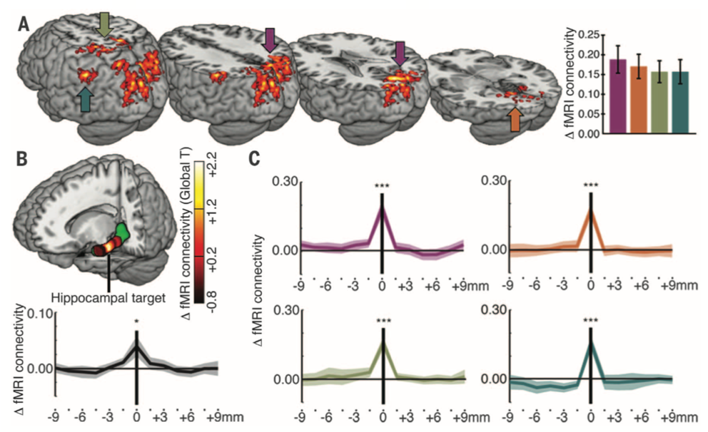
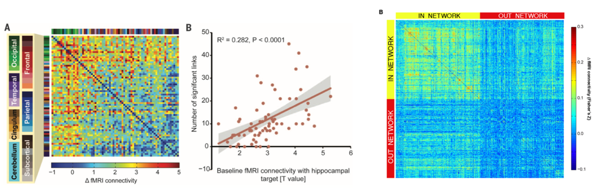
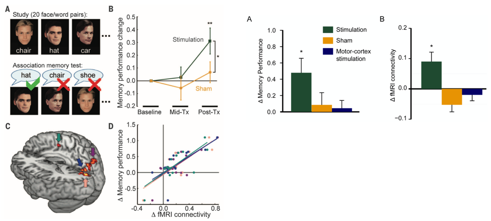

# Consciousness I: Different Approaches to the Study of Consciousness (2021-12-14)

> Course: PSYCH-UH 2412 Cognitive Neuroscience | NYU Abu Dhabi | Authors: Sean Shan Guangji & Yumi Omori

---

[← Back to Main Contents](../README.md) | [← Previous Lecture](23-tms-wang-discussion.md) | [Next Lecture →](25-consciousness-II.md)

---

## Consciousness

- "Philosophers have suggested different alternatives: that consciousness should be eliminated from science altogether because it is not a real phenomenon; that consciousness is a real, higher level physical or neurobiological phenomenon; and that consciousness is fundamentally mysterious and beyond human science."
- Hard to define in a way that is amenable to study.

---

## Consciousness: What, Where, How

### What is Consciousness?

- The mind's subjective experience; the state of being that allows us to subjectively experience the world.
- Philosophy: what does it mean to be conscious?
- Cognitive neuroscience: determine systematic forms of information processing and reproducible class of activation patterns that systematically distinguish 'conscious' mental states from other states.

### Where is the Seat of Consciousness in the Brain?

- What are the **neural correlates of consciousness (NCC)**?

### How Do We Study Consciousness Scientifically?

- Two approaches: **state-based approach** and **content-based approach**.

---

## State-Based Approach

### What Are Different "States" of Consciousness?

- **Coma**: state of unarousable consciousness, failure of eye movements and motor responses besides simple withdrawal reflexes, no coherent verbal response.
- **Persistent vegetative state/UWS**: unaware of themselves or surrounding, motor responses are not meaningful, state must be present for more than a month.
- **Anesthesia**.
- **Sleep**.
- **Dreaming**.
- **Drunk**.

### How Does the Brain Vary as a Function of "State"?

- What is predictable about the states in the brain that can help us define?

**[Video timestamp 18:48–19:41]** (Sending glutamate and acetylcholine to the thalamus) ascending tracks.

  

*Reticular Activating System diagram: visual impulses, auditory impulses, and ascending sensory tracts (pain, touch, temperature) feed into reticular formation; ascending arousal projections go to cerebral cortex; descending motor signals go to spinal cord. Illustrates role of the ascending activating system in maintaining consciousness and wakefulness.*

**[Video timestamp 19:41–21:50]** Disorder of conscious & without (a big difference in the amount of structural connections).
- Blue: connection across the cortex (frontal lobe most notable).
- Giving rise to functions.

**[Video timestamp 21:50–22:45]** Stimulate the reticular activating system — wakes up the cat.

  

*Diagram of ascending activating reticular system: brain with highlighted reticular formation (green), arrow labeled "Stimulate" → EEG comparison traces: Sleep (irregular slow-wave activity), Wakefulness (fast regular activity), Stimulation (transition from sleep to wakefulness). Demonstrates that stimulating the reticular system shifts EEG from sleep to wakefulness patterns.*

**[To 23:50]** Limitation: necessary but not sufficient.
- (植物人和正常人可能没区别)

**[23:50–28:31]**

### A Challenge to the State-Based Approach

- Our criteria for defining states may not map onto experience!
  - Patient in a persistent vegetative state was more conscious than previously thought.
  - A subsequent study found similar results in ~10% of patients with disorders of consciousness.
  - Able to answer yes/no questions!
- Definition not straightforward!

---

## Content-Based Approach

- [Visual neuroscience approach; a more popular approach.]
- Our awareness of our surroundings is not constant; we all have fluctuations.
- Content-based approach: ask "did you have an experience?"; compare neural activity on "yes" vs. "no" trials.
- The question is whether the participants did or did not have the subjective experience and how the brain activities vary accordingly, despite that the physical stimulations they received were the same.

**[Video timestamp 36:28–45]**

### Subjective Experience & V1

- Subjects detected presence/absence of grating (just at the threshold).

  

*Two visual stimuli: (c) grating present — concentric sinusoidal rings visible within a noise patch with a central fixation square; (d) grating absent — noise-only patch with a central fixation square. Stimuli are matched in physical energy; subjects must report whether they subjectively perceived the grating.*

---

[← Back to Main Contents](../README.md) | [← Previous Lecture](23-tms-wang-discussion.md) | [Next Lecture →](25-consciousness-II.md)
