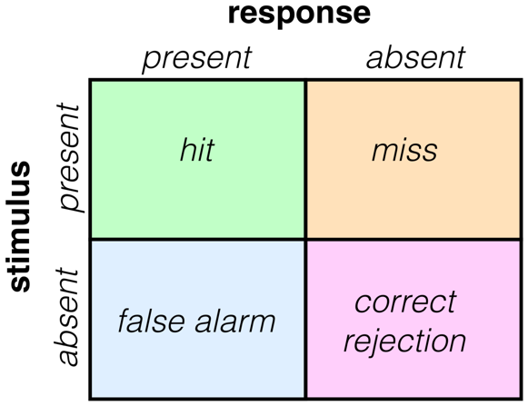
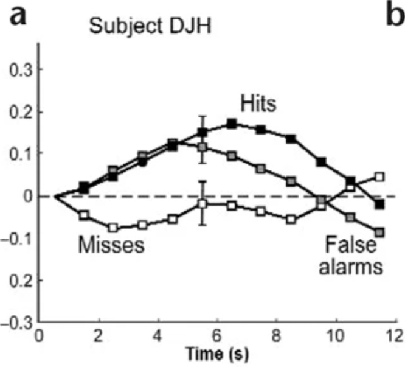
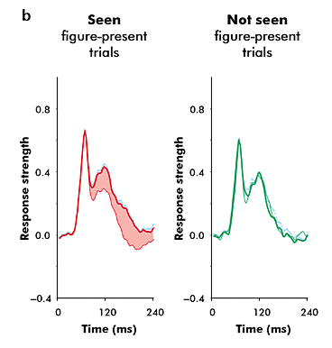
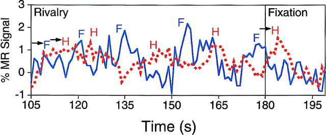
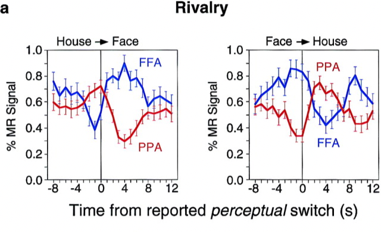
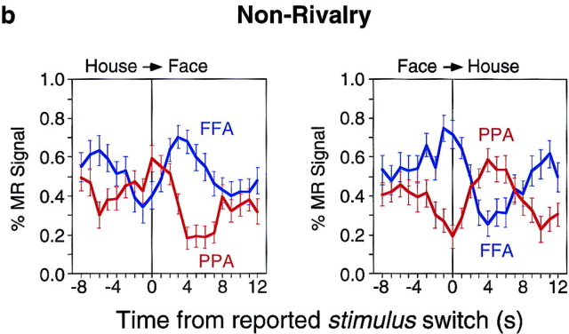
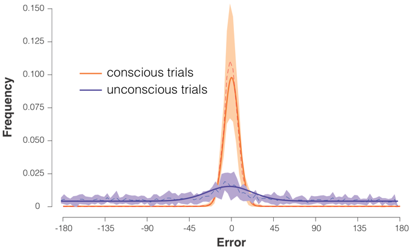

# Consciousness II: Neural Theories; Psychophysics Demonstration (2021-12-14)

> Course: PSYCH-UH 2412 Cognitive Neuroscience | NYU Abu Dhabi | Authors: Sean Shan Guangji & Yumi Omori

---

[← Back to Main Contents](../README.md) | [← Previous Lecture](24-consciousness-I.md)

---

## Continuation: Content-Based Approach — V1 Activity and Conscious Perception

### Signal Detection Framework

  

*Signal detection theory matrix (2×2): Rows = stimulus (present/absent); Columns = response (present/absent). Quadrants: Hit (stimulus present, response present — green), Miss (stimulus present, response absent — orange), False Alarm (stimulus absent, response present — blue), Correct Rejection (stimulus absent, response absent — purple).*

- **V1 activity was higher for hits vs. correct rejection.**
- **V1 activity was also higher for false alarms vs. misses.** [bold activation]

- If bottom up, low activity in false alarm; if top down, high activity in false alarm.
- Follow what we think is happening rather than what is actually happening. [Taking about awareness]

**再听47:50-52**

- Difference: whether the stimulus show up.

  

*Panel b — Two-plot figure. Left: "Seen figure-present trials" — response strength (Y-axis 0–0.8) over Time (0–240 ms); red curve shows strong early and sustained late response. Right: "Not seen figure-present trials" — response strength (0–0.8) over Time; green curve shows only an early transient peak without a late component. Demonstrates that only late V1 activity (reentrant feedback) distinguishes consciously seen from unseen trials.*

- **Only late V1 activity showed a difference between seen and unseen trials.**
- **NCC = reentrant activity to V1?**
- v1 not feed for but feedback.

---

## Binocular Rivalry and Higher-Order Visual Regions

**[Video timestamp 52–1:03]**

- Stimulus: binocular rivalry between face and house.
- Task: indicate percept: face or house.
- Use the same time series.
- Finding: activity in FFA/PPA correspond to experience, despite consistent sensory stimulation.
- NCC = activation of higher order visual regions?

  

*Time-series graph (% MR Signal, Y-axis −1 to +3) over Time (s, 105–195). Red dotted line = FFA signal; Blue solid line = PPA signal. "F" labels mark moments when subject reports face percept; "H" labels mark house percept. In the Rivalry condition, FFA rises during face percept and PPA rises during house percept — despite constant retinal stimulation. Fixation control period shown on right.*

---

## A Challenge to the Content Approach

**[1:03]**

- Our behavioral measure of conscious awareness is necessarily subjective. What if that does not reflect the "objective" state of awareness?
- **Criterion bias**: "conscious" and "unconscious" trials are contaminated in different ways depending on individuals' criterion for reporting "seen" vs. "unseen" (peters et al., 2016).

  

*Two overlapping distributions showing criterion bias. Top panel — Liberal criterion: the criterion line is placed to the left; a large portion of the "unconscious" (blue/purple) distribution falls into the "reported seen" region alongside the "conscious" (orange) distribution. Bottom panel — Conservative criterion: the criterion line is placed to the right; some conscious trials fall into the "reported unseen" region. X-axis: signal strength. Y-axis: frequency. Illustrates how individuals' criterion placement systematically biases which trials are labeled "conscious" vs. "unconscious," contaminating the comparison.*

  

*Frequency distribution plot comparing conscious trials (orange line) vs. unconscious trials (dark blue line). X-axis: Error (degrees, −180 to 180). Y-axis: Frequency (0–0.150). Conscious trials cluster sharply near 0 error, showing precise orientation discrimination; unconscious trials are broadly distributed across error values, indicating random/chance-level responses. Demonstrates objective psychophysical evidence differentiating conscious from unconscious perception.*

---

## Neural Theories of Consciousness

*(Neural theories; psychophysics demonstration)*

  

*Neural theory figure or theoretical diagram — illustrating a framework for the neural basis of consciousness, potentially depicting the Global Workspace Theory or other neural correlate models*

  

*Further neural theory diagram or psychophysics demonstration data figure*

---

## Summary: Neural Theories; Psychophysics Demonstration

  

*Concluding figure for neural theories of consciousness — possibly illustrating Global Neuronal Workspace, Integrated Information Theory (IIT), or Higher-Order Theory frameworks*

  

*Further supporting figure for neural theories discussion*

---

[← Back to Main Contents](../README.md) | [← Previous Lecture](24-consciousness-I.md)